# Quantum Cryptography

## Photons
This protocol is based on the quantum properties of light, light is a stream of photons, a photon behaves like a particle but light is also an electromagnetic wave.  
It is a transverse wave, that means the electric and magnetic oscillations are at right-angles to the direction of propagation of the wave:
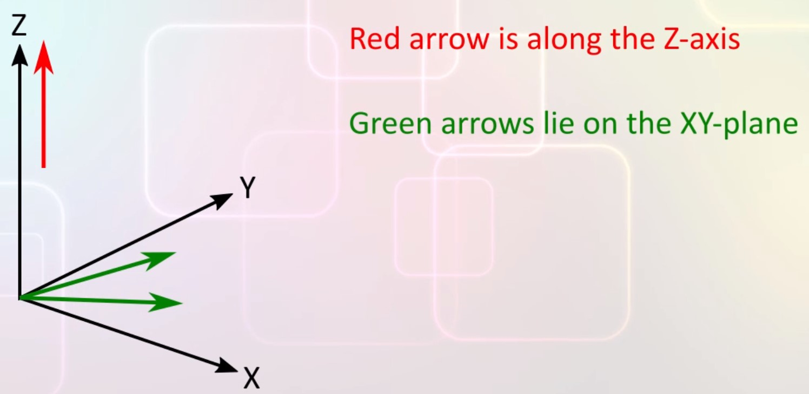  
Suppose we shine light along z-axis, the red arrow rapresent light, then the elctro-magnetic oscillations are at right-angles to the z-axis, this mean the electro-magnetic oscillations are along the X-Y plane. The green arrow rapresent one of possible direction of oscillations. All of these are perfectly valid directions for oscillations because they all lie on the XY plane. Each photon tat is directed along the Z-axis has its own angle, this angle is called the angle of polarization.  
To summarize, a photon has a property called polarization angle.  
Usually we discuss photon polarization from the poin of view of light source, fromn this point photons always travel away so polarization can be vertial or horizontal or some angle in between

## Photon polarization
There is something called polarizing filter:
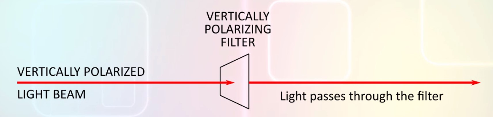  
A polarizing filter allows photons of light to pass through if the polarization of the light is the same as the polarization of the filter. A polarizing filter looks like a sheet of plastic:
- It is transparent to photons with the same angle of polarization as the filter. 
- It is opaque for photosn wich are polarized at 90 degrees to the filter (vertically polarizing filter is opaque for horizontal polarized light beam).  

If we pass a polarized photon through a polarizing filter then the photon behaves in a quantum-mechanical manner.  
Suppose the polarizing filter is vertical, it allows vertically polarized photons through. We can send any number of photons that are vertically polarized at the filter and all of them will make it through.  
Instead, suppose we send photons that are horizontally polarized, for this photons filter is opaque, none of the photons make it through.
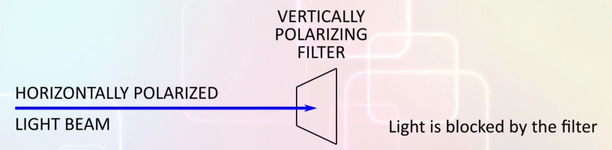  
Suppose we send photons that are polarized at 45 deg, 50% of the photons will go through the filter and the rest will be blocked. Thsi is purely random behavior.  
We cannot say which photon will pass through and which will not, if the photon is polarized at 45 deg then it has a 0.5 probability of passing through the filter.
Furthermore, all the photons that make it through the filter will be vertically polarized, remember all the photons we send to the filter started out polarized at 45 deg.
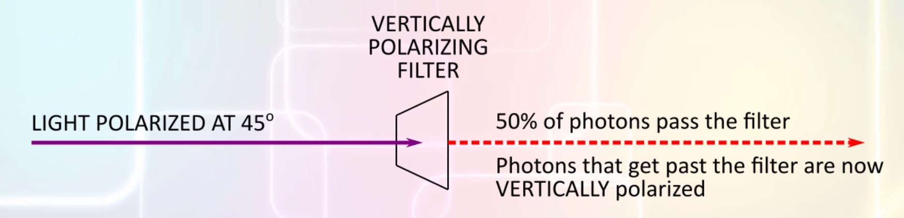  
This illustrates a foundamental idea in quantum physics: measuring a property of a system changes the system. In this case the measuring apparatus is the polarizing filter and the photons is the system being measured. Measuring the polarization angle of a photon using a filter changhes the polarization of the photons when it makes it past the filter.

Observe that when the measuring apparatus is aligned in the same direction as the property being measured then there is no randomness: 
- When the polarizing filter is at the same angle as the photon all the photons pass through, there is no randomness **DETERMINISTIC BEHAVIOR**. 
- When the polarizing filter is alighet at 90 deg to the photons all the photons are blocked, there is no randomness **DETERMINISTIC BEHAVIOR**.
- When lisght is polarized at an in-between angle, a fraction of the photons get through  **PROBABILISTIC BEHAVIOR**. Photons that pass the filter are polarized at the same angle as the filter.

## Experiments with photon polarization
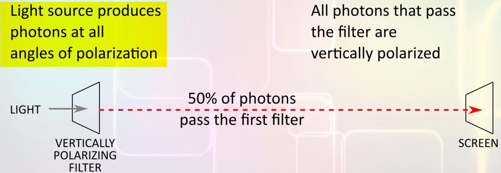  
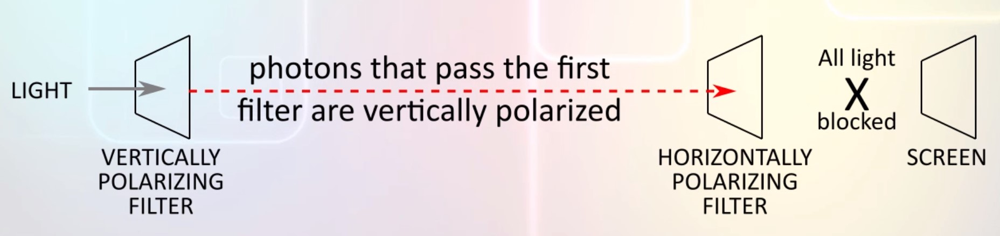  
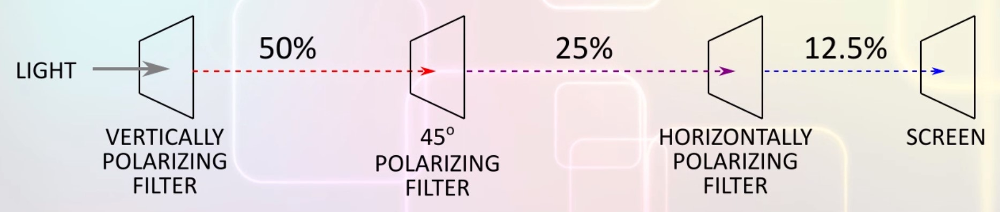  
This experiment proves that polaring filter are not really filters, they are **quantum mechanical measurement devices**. Quantum measurements change the state of the systems being measured.

## No-Cloning theorem
Given a quantum system with an unknown state, we can't measure more than one property of the system. This is because the first property we measure will change the state of the system so the subsequent measurements are actually measuring a different system.  
One possible work-around might be to clone the system then we can measure a different property of the system from each clone.
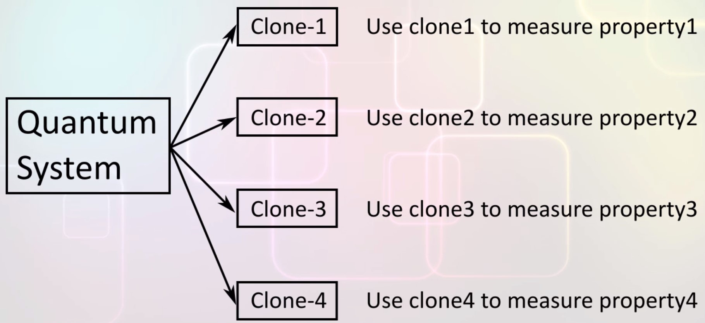  
Unfortunately, this scheme cannot work. It is physically impossible to clone an unknown quantum system this is called the **no-cloning theorem**.  
If you know all the system's parameters you can still make identical instances of a system with those parameters but if a system's parameters are unknown, you cannot clone it.

## Encoding with XOR
Foundamentals idea:
- Any measurement of an unknown system changes the system being measured
- No cloning: Can't clone an unknown system
- When the measuring apparatus is aligned at the same angle as the system, the system is not changed by the measurement

The interesting thing abount XOR is that if you XOR the same set of bits again, you get back the original:
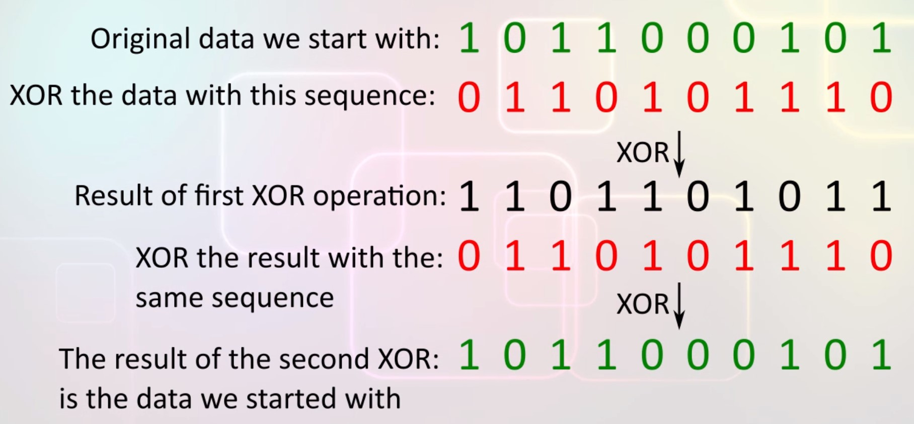

## Encryption with single-use-shared-secret
Suppose Alice wants to communicate with Bob if they both share a secret sequence of bytes that is longer that the message tey want to communicate then Alice and Bob can communicate securely.  
Alice first XORs her message with the shared secret sequence and sends it to Bob, he XORs the secret sequence again and recovers the message sent by Alice.  
If the shared secret is a random sequence of bytes and if **each shared secret is used only once** then this code is unbreakable.  
So now the problem is to securely establish a shared secret sequence of bytes.

## Encoding data in photon polarization
Alice and Bob are connected by two channels of communication, both are potentially insecure. 
- There is a classical channel for communication, something like internet or radio, anyone can eavesdrop on this channel. 
- There is a quantum channel where Alice can send Bob polarized photons

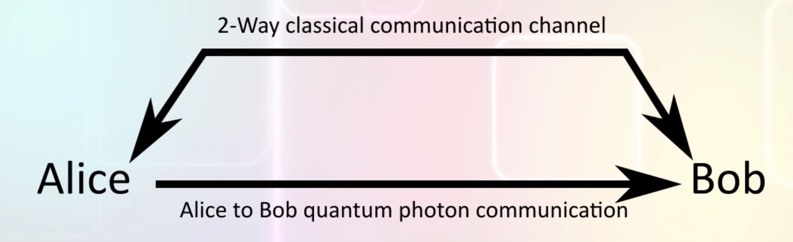  
Alice first creates a long sequence of random bits, now she needs to send it to Bob in a secure manner. Once he receive the bits they can use it as a shared secret in some future communication between themselves.  
The important thing is not all of the bits which Alice has created here will be in the final shared secret, a random fraction of these bits will be lost during transmission when we apply the BB84 protocol so only a fraction of these bits will reach Bob and become the shared secret.  
Moreover, neither Alice nor Bob will be able to control which bits are corrupted during transmission, the process is random.  

Lets supposse that Alice encodes the bits with vertical and horizontal polarization this way:
- Vertical polarization   -> 1
- Horizontal polarization -> 0

Unfortunately, anyone eavesdropping on the quantum channel can read the data being sent without either Alice or Bob realizing that their security has been compomised.  
Suppose Eve wants to eavesdrop:
- Measure photon with polarizing filter
- Decode bit-value of photon.
- Create new photon for the same bit value
- Send new photon to Bob

Observe that Eve was able to "read" the photons because she knew that by aligning the polarizing filter vertically there would be no randomness.  
But if Eve didn't know how to align the filter she wouldn't be able to read the data reliably.  

## Making the protocol secure
To prevent eavesdropping, Alice modifies her protocol, Alice chooses to encode a randomly chosen 50% of the bits in her sequence the same way as before. But for the other 50% Alice encodes:
- 45 deg right polarization -> 1
- 45 deg left polarization  -> 0

The choice of which encoding to use for each bit is made at random, there is the 50% probability that Alice will chose the vertical/horizontal encoding and the rest 50% probability with 45 deg encoding. 
Bob who is receiving the photons doesn't yet know the encoding that was used for each bit. Since Bob doesn't know, he makes random guesses, 50% of the time he guesses correctly
and 50% of the time he guesses wrong.
When the polarizing filter is not aligned with the angle of polarization of the photon the behavior of the photon is random.  
So Bobs's attempt to decode these bits using his wrong guesses result in a random set of bits.
This are the 50% bits are the ones that get corrupted and are lost in transmission.  
(+: vertical/horizontal, X: 45 deg, -: horizontal, |: vertical, \: 45 deg left, /: 45 deg right)
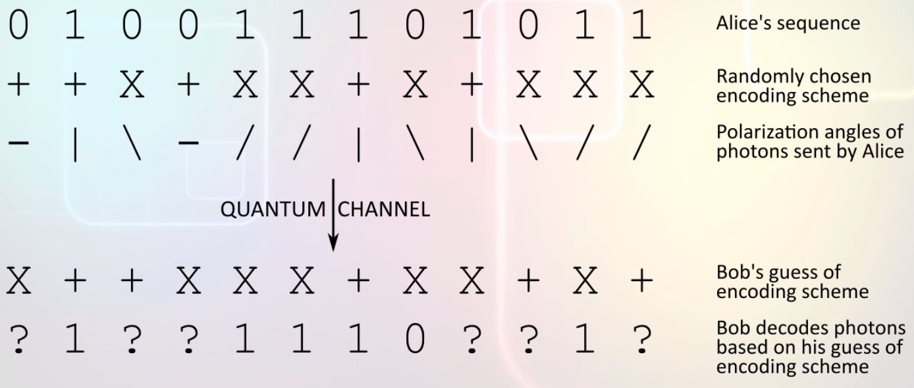  

## Exchangig polarization angles
Alice has another way to communicate with Bob, the classical channel here, after Bob has received all the photons sent to him he lets Alice know through this classical channel.
Alice then sends him the encoding she used for each bit through the classical channel. Observe that Alice doesn't send the bits themselves she only sends the encoding she used.  
Whit this information bob knows which bits had been correctly decoded by him and which ones were wrongly decoded, Bob also send Alice his guesses on the angle of encoding. So both know the bits where Bob guessed correctly and where he guessed wrong.  
Both Alice and Bob discard the bits for which Bob made wrong guesses and retain correct guesses.  
The bits for which Bob guessed the encoding wrong are corrupted and lost the others are their shared secret using the XOR.

## Why is the BB84 protocol secure
The key idea here is that Alice reveals the encoding to Bob only after Bob has received all the photons. If instead, Alice had messaged the encoding to Bob earlier, then Eve could have eavesdropped. With prior knowledge of the encodings  Eve could have aligned her eavesdropping apparatus to decode each bit as it was sent and then resent the bits to Bob.  
But in this protocol, Alice reveals the encodings only after Bob has received the photons. This is too late for Eve to use in eavesdropping. Instead, if Eve tried to eavesdrop by guessing the encodings, there will be randomness in the measurements caused by wrong guesses. Eve's attempt to eavesdrop will corrupt some of the bits sent to Bob. Alice and Bob ca detect that some bits have been corrupted by exchanging a checksum trough the classical channel.

## Analysis
We now have a protocol that allows Alice and Bob to share a secret key over insecure communication channels. Once they have a shared secret Alice and Bob ca use a 1-use-shared-secret encryption wich is unbreakable.  
The security of the protocol is based on quantum behavior of photons.  
The law of physics don't change when we develop new technologies, so this protocol will remain secure in future. Thi is important because RSA was consider secure until it was shown that quantum computers can crack RSA encryption.  