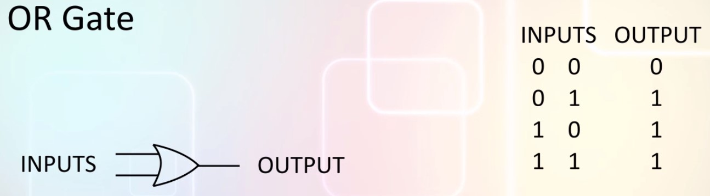

# Foundation: Complex Numbers, Probability, Linear Algebra & Logic

## Probability
Probabilities add up to 1
  
If probability of picking an apple is x then probability of picking an orange is 1-x.  
Another thing to remember is that though final probabilities are always positive numbers between 0 and 1, intermediate values in computations can be negative.  
```P(A or B) = P(A) + P(B) = P(A) + P(B) - P(A and B)```

## Complex numbers
While solving equations, we often come across equations like this: x^2 = -1. Clearly there is no suck x, it doesn't make sense to say that x squared is -1 if x were a number that we were going to use in the real word. But sometimes we are calculating intermediate values that are going to be processed further in some way before being used in the real world.  
Perhaps x means "square root of the correction factor", in that case saying x squared = -1 makes sense.  
x squared is the correction factor and that is -1. If we have defined x as the square root of the correction factor then we need some way to write the value of x and perform computation on it.  
The square root of -1 is an imaginary quantity and we give it a name **i** so we can talk about it as though it were a real quantity.  
Any nth root of any negative number can be written in terms of **i**: ```a + bi```
  
Any nth root of a complex number is also a complex number.  
Complex numbers are the foundation of quantum physics

You can multiply, divide, add and subtract complex numbers just like you would real numbers.  
**Add or subtract:**  
  
**Multiply**  
  
If you see an i squared you can replace it with -1  
**Division**  
Division is a little tricky, to divide complex numbers, we need to know about complex conjugates.  
Suppose to hav a complex number ```a + bi```, if you change the sign of the imaginary part then you get the **complex conjugate**.  
Now lets learn how to divide, the trick is to multiply the numerator and denominator by the complex conjugate of the denominator.  
  
  

NB: if you multiply a complex number by its complex conjugate you always get a positive real number called the square magnitude of the complex number that is the square of the real part plus the square of the imaginary part

## Matrix algebra
A matrix is a table of numbers arranged in rows and columns.  
  
The dimension is describet with: ROWS x COLUMNS.  
### Multiply by a scalar number
We can **multyply any matrix by a scalar number**. Like this:  
  
We just multiply each element in the matrix by the scalar.  
### Addition subtraction with the same dimension
If matrices has the **same dimension** then they can be **added or subtracted**. Like this:  
  
Each element is added or subtracted from the corresponding element.  
### Transpose
We can also perform an operation called **transpose**. The transpose of a matrix is a new matrix we get by exchanging the rows and columns. Visually this is the same as flipping the matrix around the diagonal.  
  
Observe the way the matrix is mirrored about the red line. Transpose is possible even if the matrices are not square. 
### Complex conjugates 
If the matrix **has complex numbers** you can find the complex conjugate of the entire matrix by taking the conjugates of each element.  
  
### Adjoint
If we calculate the complex conjugates and transpose the matrix we obtain an operation called **adjoint**.  
  

## Matrix multiplication
Matrix multiplication **it is not commutative**. If A is a matrix and B is a matrix then AB is different from BA.  
Whit the multiplication the rule to determine if two matrices can be multiplied is different.  
If matrix A is of dimension x by y and B is of dimension y by z then it is possible to compute AB.  
```If the number of columns in A is the same as the number of rows in B then the product AB can be computed```  
Suppose to have matrix A and B  
```
|  1   7   8|   |  2   9   3|
|  3  -1   2| x |  8   5   6|
| 11   9   4|   |  1  -3   1|
```
Take the first row of A multiply each element in this row with the corresponding element of the first column of B: (1x2) + (7x8) + (8x1) = 66  
Take the same first row of A multiply the second column of B, this become the element in the second column of the first row: (1x9) + (7x5) + (8x-3) = 20.
Similarly, multiply the first row of A and the third column of B
```
| 66  20  53|
|  0  16   5|
| 98 132  91|
```

## Identity matrices
The identity matrix is always a square matrix but the number of rows and columns can change.  
In the identity matrix all the elements in the diagonal from the top-left to the bottom-right are 1, the other element are all 0.  
We call it identity matrix because when it is multiplied by a second matrix, the result is the same as that second matrix.

## Asimetric matrices multiplication
The result of a matrix multiplication is the number of rows in the first matrix by the number of collumns of the second matrix.

## 1x1 matrix
Lets multiply this 1 by 3 matrix and this 3 by 1 matrix the result ought to be a 1 by 1 matrix.
```
             | 4|
| 1  2  3| x | 5| = |32| = 32
             | 6|
```
When we get a 1 by 1 matrix as result, in quantum mechanics, we treat it like a scalar

## Logic circuits
**AND Gate**  
  

**OR Gate** 
  

**NOT Gate** 
  

**NAND Gate**
  
In ters of hardware, the NAND gate is a universal gate, whit just this one kind of gate we can build any kind of logic circuit. We don't need 3 kinds of gate hardware.  

If we connect the inputs of the NAND gate toghether then the NAND gate behaves like a NOT gate:  
  
If we connect this NOT gate to the output of a NAND gate, then the two NAND gates toghether behave like an AND gate:  
   
If we connect the NAND gate like the configuration below, we get an OR gate:  
  