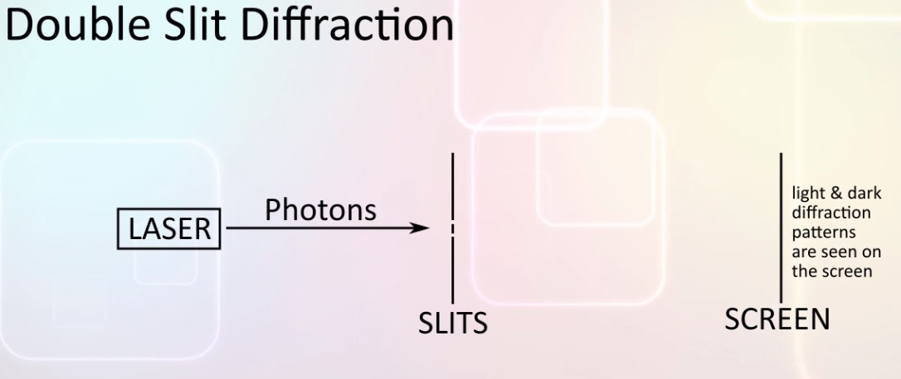
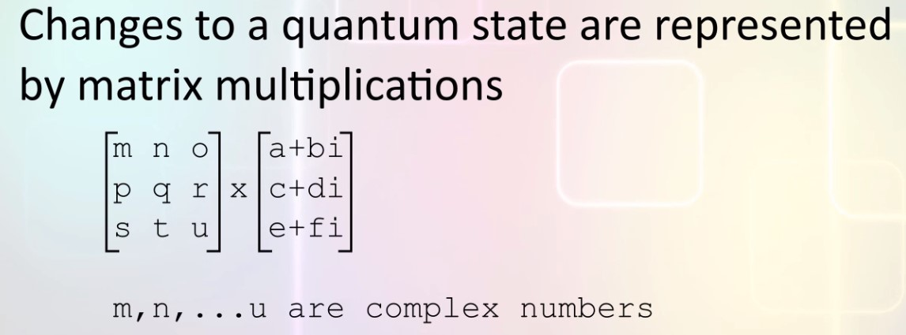
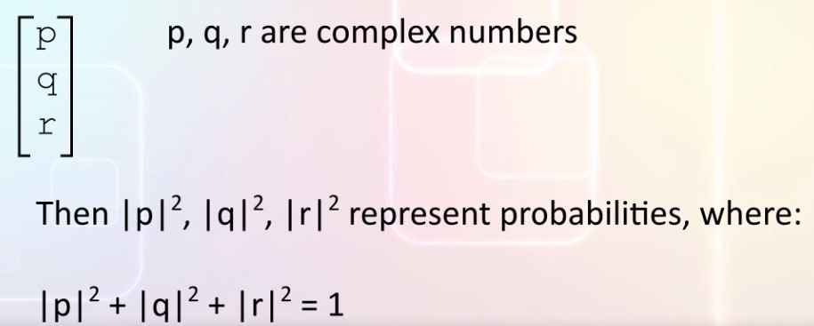

# Developing a math model for Quantum physics

## Subtractive probabilities through complex numbers
Quantum physics is based on probabilities, but what kind of probabilities?  The double-slit experiment offers some clues about the kind of mathematical model we need.  
The bouble slit experiment uses apparatus like this:  
  
There is a light source (the laser), the light is directed at an opaque sheet that has two parallel narrow slits placed very close to each other. Light can pass through the slits.  
There is a screen on the far side of the slits.  
We se an interference pattern on the screen, a series of light and dark vertical bars.  
The classical way to explain the interference pattern is to say that light can also behave like a wave. In contrast of classical physics quantum mechanics uses probabilities to model the interference pattern.  
Explained in term of probabilities the bright spots are where the brobabilities add up, the dark spots are where the probabilities cancel out.  
This gives us a clue about the mathematical model we need for quantum mechanics:  
Probabilities need to be able to cancel out.  
That is, some probability terms will need to be subtractive.  

Physicists have also found that many of the formula in quantum mechanics operate on the square root of the probabilities. Since probabilities can be subtractive when we compute square-roots we can end up with square roots of negative numbers (complex numbers).  
The mathematical model we need for quantum mechanincs will use complex numbers to represent square roots of probabilities.  

## Modeling superposition through matrices
The simplest quantum system is the **Qubit,** the quantum equivalent of the **bit** we use in classical computers.  
```The qubit can be in state "off" or in state "on" or a "superposition" of off and on.```  
This give us another clue about the kind of mathematical model that will be suitable for quantum mechanics:  
```A system in superposition requires more than one number to define it.```  
We will need a collection of numbers to define a quantum system in superposition.  
A mathematical tool to work with collections of numbers is _matrix algebra_ also known as _linear algebra_ 

## Overview
Putting all the clues together, we see that quantum states are represented by colum matrices of complex numbers.
```
|(a+bi)|
|(c+di)|
|(e+fi)|
```
Changes to this state are represented by multiplying the column matrix by a transformation matrix:  
  

A quantum state without superposition is represented by a single number in the column matrix, all others are 0.  
Square magnitudes of the numbers in the column matrix represent probabiliies.  
Square magnitudes of the complex numbers in the column matrix add up to 1.  
  