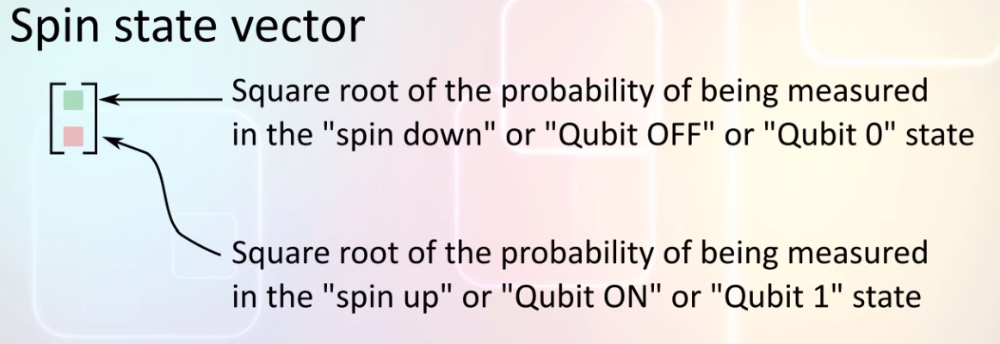
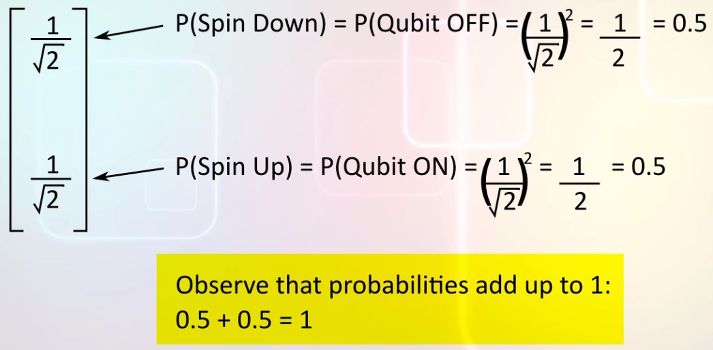
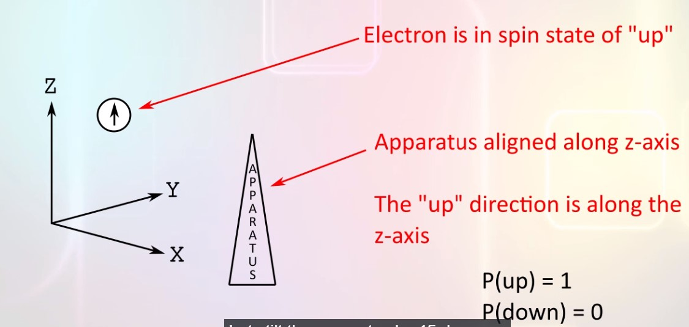
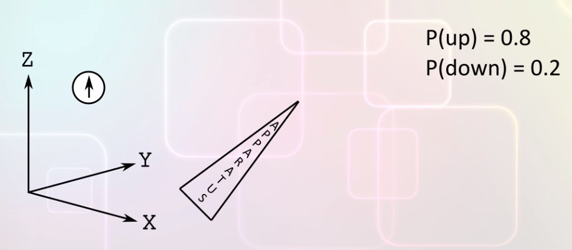
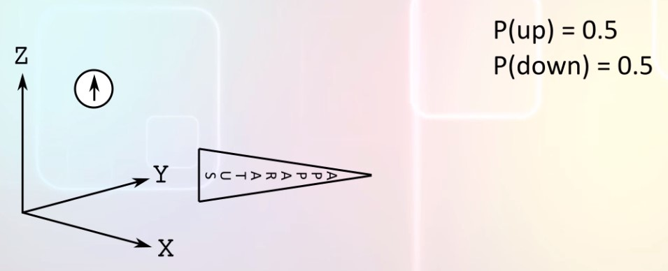
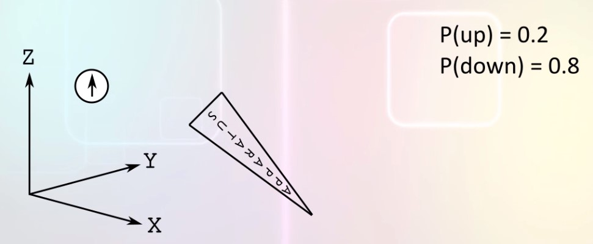
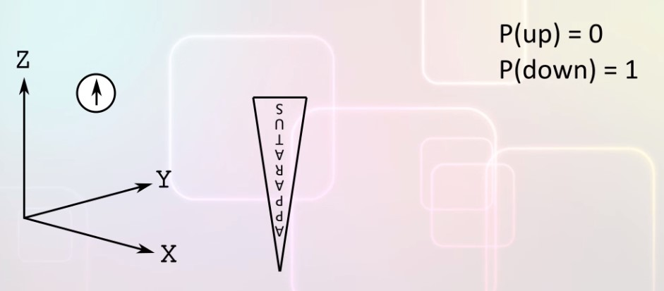
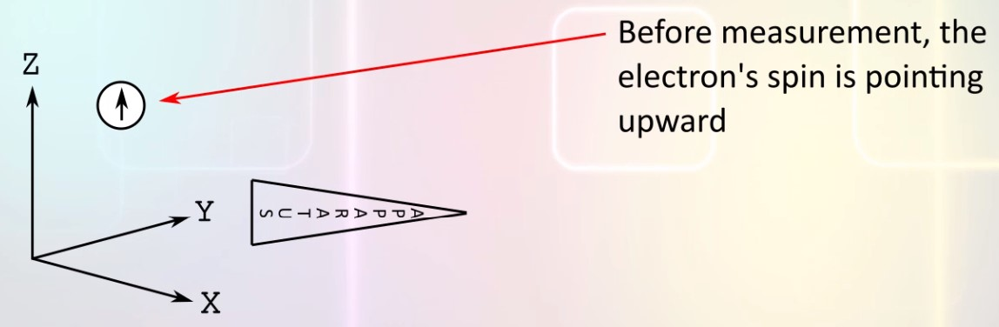

# Quantum physics of spin states

## Introduction to spin states
When electrons move in a magnetic field, they are deflected as though they were little magnets.  
Electrons could behave like little magnets if they were spinning, in reality electrons are not spinning like little tops but the name has stuck.  
This magnetic property of electrons is called spin.  
The **spin** can be measured to be up or down, it is the only measurement that can be performed on spin.
The spin can be used as the quantum equivalent of a "bit":
- Spin "UP"   -> Quantum bit in state 1
- Spin "DOWN" -> Quantum bit in state 0

## Basis
We need a base to describe the spin quantum state. In Newtonian physics, we use the three axes x, y and z to describe location and motion in 3 dimensional space.  
The three axes form the basis for classical mechanics.  
The analogous basis for a spin qubit could be **UP** and **DOWN**.  
What makes this a good basis? These properties:  
Once a spin has been measured as **UP**, the probability of it being measured subsequently as **DOWN** is 0; similarly once a spin has been measured as **DOWN** the probability of it being measured subsequently as **UP** is 0.  
This mean that **UP** and **DOWN** are orthogonal.  
Furthermore, when measured, the spin is either up or down.  

In our mathematical model, we will represent the quantum state of a qubit by a column matrix with 2 elements:
```
Spin down state    Spin up state
     | 1|              | 0|
     | 0|              | 1|
```

## Column matrix representation of quantum state
In quantum physics, the number which descrive a state are written as a column matrix, a column matrix is called a **VECTOR**. To avoid confusion remember that a ector in quantum physics is jus a column matrix. It has nothing to do with the classical physics vectors like velocity that have a magnitude and a direction.  
A vector which represents a qubit has two elements: 
- The upper number is the square of the magnitude of the number of the probability of being measured in the _qubit-off_ or _spin-down_ state
- The lower number is the square of the magnitude of the number of the probability of being measured in the _qubit-on_ or _spin-up_ state

  
Since the two numbers in the column matrix could be complex numbers the square magnitude is computed by squaring the real part and adding it to the square of the imaginary part.  
Square magnitudes of all the complex numbers in a state vector add up to 1.  
  

## State vector
Consider the below vector, if a qubits in this state were measured, the probability of the qubit being measured as OFF ir spin-down is 0.5 and the probability of the qubit being measured as ON or spin-up is 0.5.  
  
If an element of the vector is 0 and the other 1 we say that the behavior is **deterministic** and not **probabilistic**.  
Apparatus for measurement is not always aligned in the UP or DOWN directions, when the it is aligned in a different direction even states like [0 1] and [1 0] will produce probabilistic measurement results.  
Another idea we will see is that measurement changes the state of a qubit.  
The first measurement of an unknown qubit state produces probabilistic results.  
But this measurement changes the state of the sustem being measured so that subsequent measurements produce deterministic result

## Experiments with spin 1
Whe have an apparatus for measuring spin, lets align the apparatus vertically along the z-axis. The apparatus will measure an electrn's spin and report UP or DOWN.  
Recall from previous, when we measure a system the system is changed by that measurement.  
Suppose we have a randomly chosen electron with an unknown spin since we have randomly chosen the electron the spin is likely to be a superposition of up and down.  
When we measure the spin with our apparatus will either be UP or DOWN, the measurement cannot report a superposition state.  
Suppose the apparatus reports UP: we don't know what the state of the electron was before the measurement but after the measurement we know that the state is now UP. In all the subsequent measurement our apparatus reports UP.

## Experiments with spin 2
The first measurement changes the state of the system, so that subsequent measurements are deterministic and the result of subsequent measurements is the same as the first measurement.  
Ok so now we have an electron whose psin has been measured to be UP by our apparatus, for each subsequent measurement using the same apparatus the result continues to be UP.  
  
Lets tilt the apparatus by 45 degree  
  
We don't actually perform a measurement because that would change the spin state of the electron, instead we just asking an hypotetical question: What would happen in this arrangement?  
There is an high probability that the measurement apparatus will report UP but now there is a definite non-zero probability that the apparatus will report DOWN.  
What if we tilt the apparatus further so that it is horizontal?    
  
Again we don't actually make any measurement. If we actually measured using the apparatus, then the spin state of electron will change, so in this case, for the hypothetical question, the apparatus will report UP with a probability of 50% and DOWN with a probability of 50%.  
What if we tilt it more?    
  
This apparatus will measure DOWN whit 80% probability and UP whit 20% probability.  
If we turn the apparatus all the way upside down, then the apparatus will always report DOWN.    
  

## Experiments with spin 3
Lets rotate the apparatus to the horizontal position, and then we make a measurement:    
  
Recall that any measurement that is not aligned with the electron's current state will change the electron's spin state. So this measurement will change the spin state of the electron.  
The measurement will yield either up or down with equal probability.  
Lets suppose the apparatus measures DOWN, after this measurement the electron spin state has changed:    
  
Next lets rotate the apparatus back to its original position, if we measure the electron spin now it will be either up or down with equal probability, this is because the electron spin is now horizontal