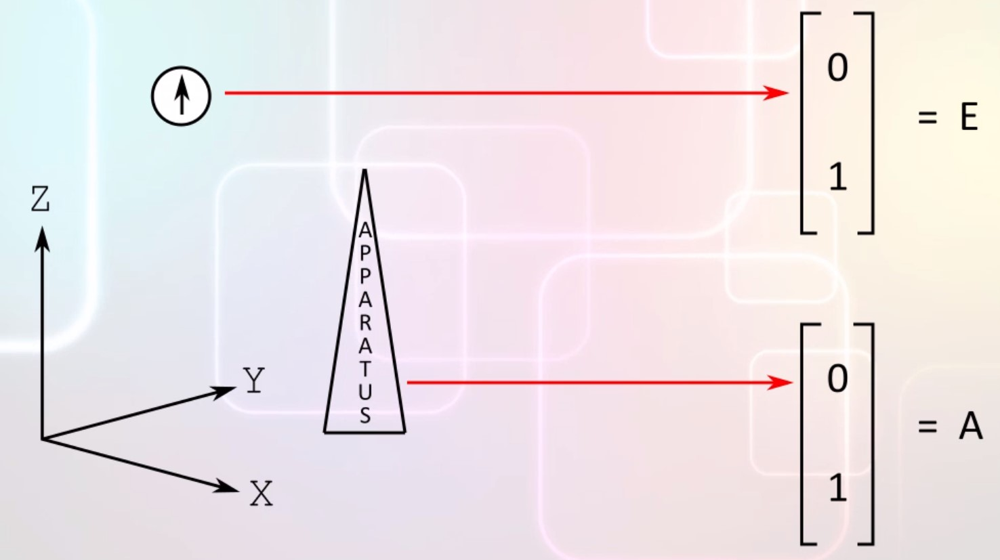
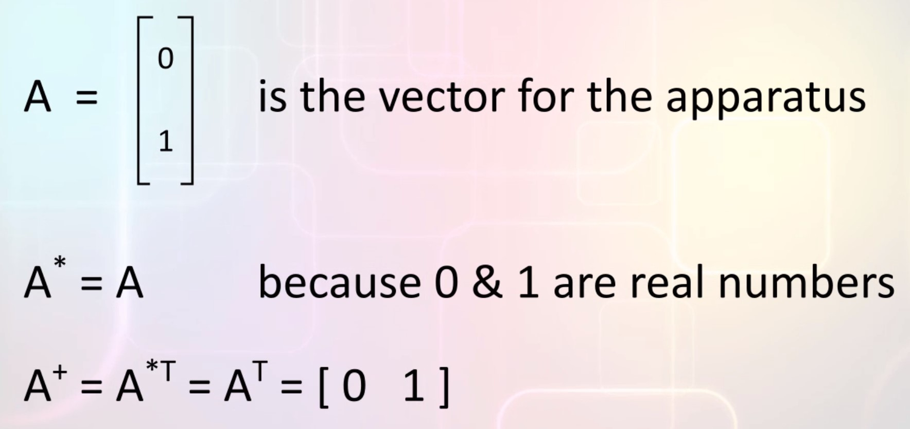
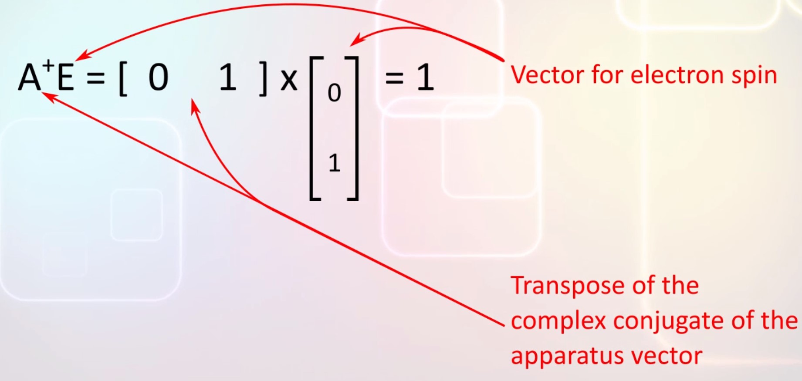
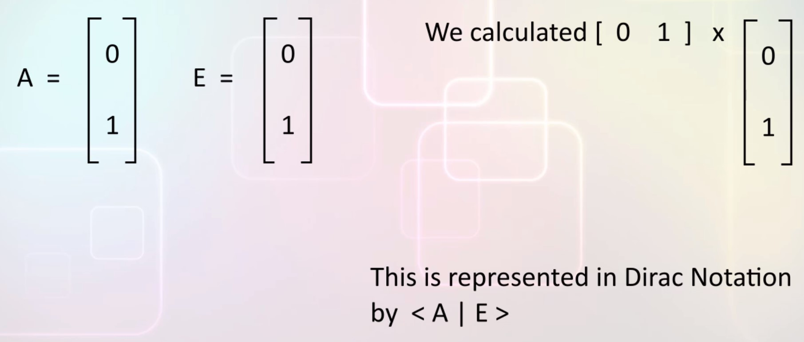
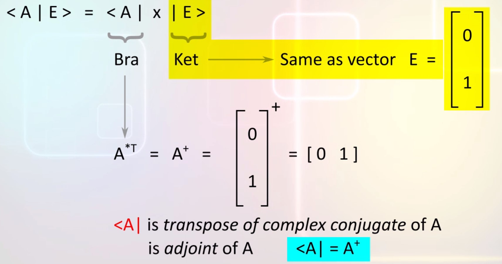
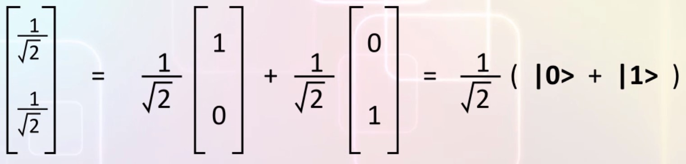
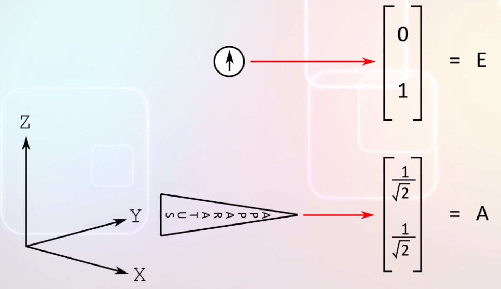
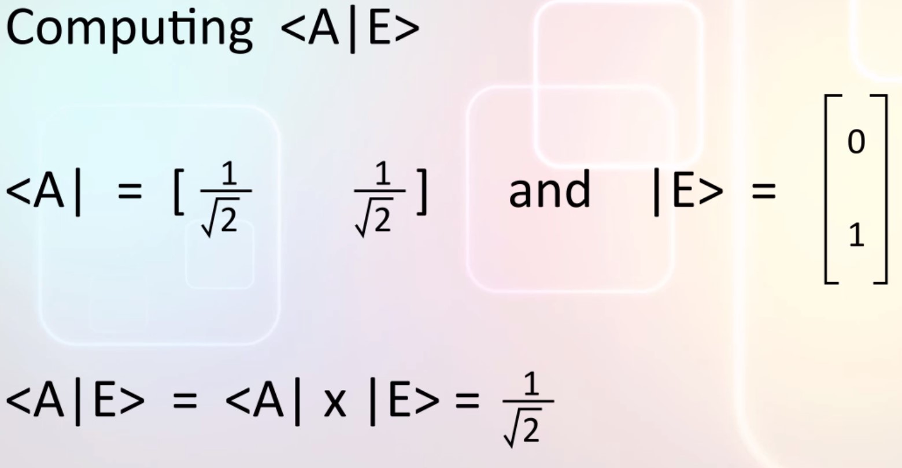
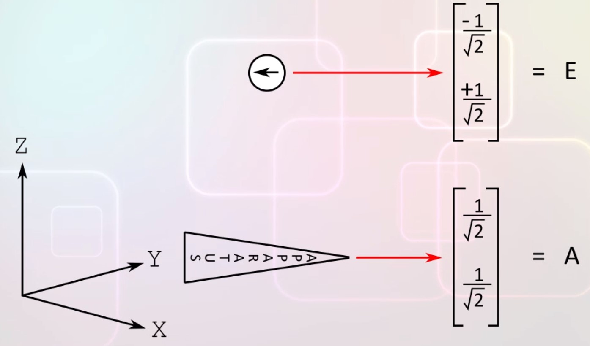
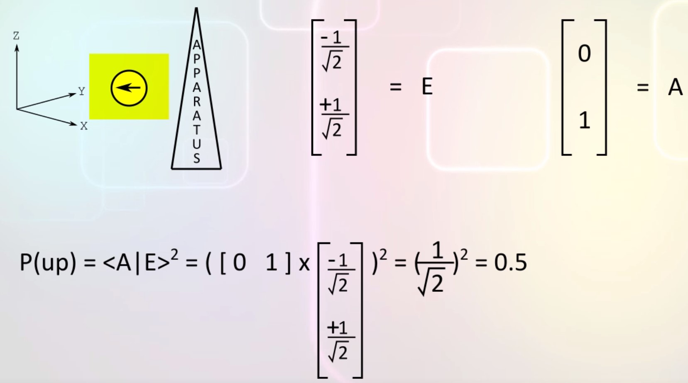

# Modeling quantum spin states with math

## Analysis of Experiments
A state of a quantum bit can be represented as a vertical column matrix with two elements:
```
| p| <--- Square root of P(down)
| q| <--- Square root of P(up)
```
Now we are gogig to be more precise about these probabilities, every measurement on a system affects the system so we can think of measurement as a transformation of the system.  
In quantum physics every transformation is modeled by a matrix multiplication on the state-vector of the system.  
Lets consider the situation at the beginning of our experiments:  
  
We have completed one measurement, the spin was measured as UP. Matematically the spin of the electron is in the state:
```
| 0|
| 1|
```
The measurement apparatus is als vertically aligned pointing up:
```
| 0|
| 1|
```
A fine point about this measurement apparatus, it measures if the state of the electron spin is up or not, the result of measurememnt is _UP_ or _NOT UP_, it doesn't actually measure DOWN directly.  
Matematically if the apparatus were to measure DOWN its vector would be 
```
| 1|
| 0|
```
To compute the probability of our measurement apparatus obtaining UP from the measurement, we need to take the inner product of the measurement vector with the electron's state vector.  
- Take the complex conjugate of the apparatus vector
- Take the transpose
- Matrix multiply the two vectors

  
  
The result is 1, the square of this number is the probability that measuring the spin of the electron with the apparatus will produce a measurement of UP.  
The probability is 1 means that every measurement will yield UP, the result is deterministic not probabilistic.  
Recall that the state of the spin was [0 1] after the first measurement.  
This math explains why every subsequent measurement aslo yield UP

One thing to observe is that the measurement changes the state of the system regardless of the kind of apparatus you use.  
The system isn't changing because we don't know how to make an apparatus that doesn't affect the system being measured.  
The idea that every measurement changes the state of an unknown system is an integral part of the laws of quantum physics.  
The math model tells us how the system is changed when we make a measurement, it is not possible to contruct any alternative apparatus that measure without changing the system.

## Dirac Bra-Ket Notation
Dirac developed a special notation for inner products called the Bra-Ket notation. The calculation we did before looks like this:  
  
(A: vector of apparatus, E: vector of electron spin)  
The Bra-Ket can be written in two parts: the Bra <A| and the Ket |E>.  
The Ket operator refers to the vector itself with no changes, the Bra operator refers to the transpose of the complex conjugate (**adjoint**) of the vector.  
  

The Bra-Ket can also be used to write the qubit vectors in algebraic expression without using matrix notation:  
  
The vector **[1 0]** represent the qubit being in the OFF state lets call it **|0> (Ket 0)**  
The vector **[0 1]** represent the qubit being in the ON state lets call it **|1> (Ket 1)**  
Then a vector in superposition [1/root(2) 1/root(2)] can be written as 1/root(2)(|0> + |1>)  
  
Remember that |0> and |1> are just names for vectors.

## Experiment analysis
Returning to our spin experiments:  
  
The apparatu vector reflects the new orientation, how did we get this vector? Well we know from experiment what the probability of measuring UP or DOWN will be when the apparatus is oriented horizontally, this vector makes the math work.  
Now lets compute <A|E> with the new value of A:  
  
```P(UP) = <A|E><A|E> = 0.5```  
The square of the result numer is 1/2, so the probability that the apparatus will obtain a measurement of UP is 1/2.  

After the measurement the electron spin state changed and it is now pointing in the opposite direction to the apparatus:  
    
Instead, if the horizontal measurement had been UP, then the new state vector of the electron spin would have been the same as the apparatus.  
Intuitively, you might have thought that the opposite direction to the [1/root(2) 1/root(2)]T vector would be -1 x the vector but that is NOT correct.  
Lets pause for a moment and think about what it means for a state vector to represent an opposite direction in the physical world.  
Suppose an electron spin's state is represented by vector E and an apparatus by vector A.  
If A is pointing in exactly the opposite direction to E then in terms of measurement probabilities the probability of the apparatus measuring UP is 0 that is, the apparatus will always measure DOWN.  
In terms of matrix products, this means that ```P(UP) = <A|E><A|E> = 0 so <A|E> = 0```.  
To rephrase that: **if** two state vectors X and Y represent the **opposite directions** in the physical world **then** in terms of matrix products **<X|Y>=0**.  
Now lets return to the experiment, the apparatus state vector is [1/root(2) 1/root(2)]T, the electron spin state will be a vector, such that, when the adjoint of the apparatus vector is multiplied with it, the result is 0.  
We see that if the electron spin state is [-1/root(2) 1/root(2)] this condition is satisfied.  
So the P(UP) = 0, this means that P(DOWN) = 1.

Next lets move the apparatus back to the vertical position:  
  
Observe that the electron spin is now horizontal because we measured it with the horizontal apparatus and after that we haven't done anything to change its state.  
The <A|E> Bra-Ket value is 1/root(2), squaring it we see that the probability of the apparatus measuring UP is 0.5. This also agrees with the experiment.

## On random behavior
There is a myth that the state of a system is random in quantum physics, that is not true at all. When we say that the state of the electron spin is [1/root(2) 1/root(2)] there is no randomness here at all the state is well definde.  
When we say that the apparatus vector is [0 1] there is no randomness here either.  
Random behavior appears only when we measure the system in a direction that is not aligned with the state, this is a loose definition.  
So i will clarify with the examples: initially electron spin is in the state [0 1] and the apparatus is also in [0 1] then the result is deterministic, it is only when the apparatus is oriented to [1/root(2) 1/root(2)] while the spin in in [0 1] that the random behavior occurs.  
The randomness is caused by the measurement, the state of the quantum system is not random.  
It occurs only for the first measurement, after that the behavior is determinitic.  
You might recall the same behavion with photon polarization, if you aligned a polarizing filter in the precise direction in which a photon is polarized there is no randomness.  
But if you don't then any measurement will produce random behavior.