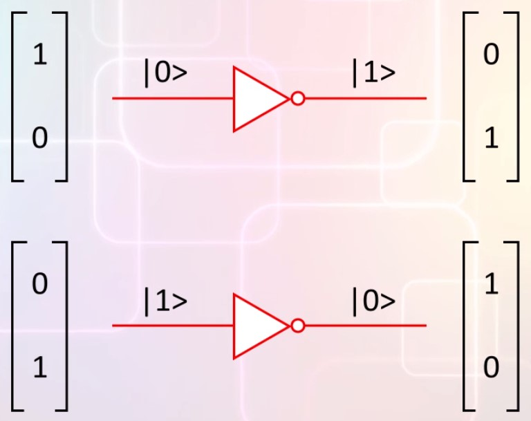

# Reversible and irreversible state transformation

## Irreversible transformation: measurements
Measurement is irreversible, why? Because after measuring a system in an unknown quantum state, you can't restore the system to whatever state it was in before the measurement.  
The measurememtn cause the state to change in a way that destroyed information about the prior state before measurment.  
An example: if you  measure electron spin and get UP you don't know if the previous state was [0 1] or [1/root(2) 1/root(2)] or [1/2 root(3)/2] ... .  

## Reversible state transformation
Suppose electron spin were used as the qubit in a quantum computer, UP = 1 and DOWN = 0:  
```
Qubin in state |0>      Qubit in state |1>
      | 1|                    | 0|
      | 0|                    | 1| 
```
Suppose we send thi qubit as in put to a NOT gate, the NOT gate is a reversible transformation  
  
In our mathematical framework reversible transformation are made by multiplying by a special matrix.  
The matrix for the not operation is this: 
```
| 0  1|
| 1  0|
```
Lets apply the NOT operation to qubit value 0
```
| 0  1|     | 1|   | 0|
| 1  0|  x  | 0| = | 1|

```

## Summary
We are discussing the difference between irreversible and reversible operations because quantum computation have a fixed pattern:  
