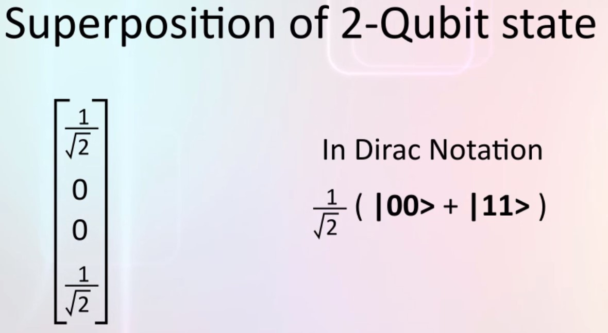

# Multi-qubit system

## Analyzing multi-qubit system
If we have two qubits, we just write down all the possible combinations: 
```
0 0 --> 1 --> |00>
0 1 --> 0 --> |01>
1 0 --> 0 --> |10>
1 1 --> 0 --> |11>
```
The state vector will have four elements, one for each combination.  
We can perform measurements and reversible transformations on multi-qubit states exactly like single qubits states.

## Superposition of 2-qubits state
The state can be in superposition:  
  
What do the numbers in this state vector mean?  
If we set up an apparatus to measure if the two qubits are both 0, then the probability of the measuremennt apparatus producing result of YES is the square magnitude of the first number. ```P(00) = 0.5```  
Similarly if we measure if the first qubit is 0 and the second qubit is simultaneously 1 the probability of that is the second number, same for the P(10) with the third number. ```P(01) = 0``` and ```P(10) = 0```  
Finally the probability of both qubits being 1 is the square magnitude of 1 by root 2 which is 0.5. ```P(11) = 0.5```  