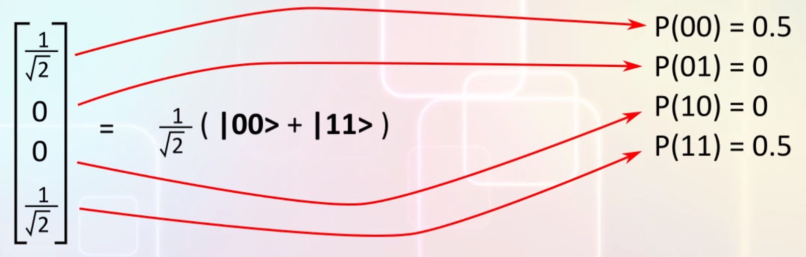

# Entanglement

## Entanglement
Consider this state vector for a two qubit system:  
  
The probability that first qubit has the same value as second qubit = 1.0, whatever measurement we make on a system in this state, the two qubits will be equal.  
The value of one qubit is connected to the value of the other qubit.  
In this case we say that the two qubits are **ENTANGLED**.  
Mathematically, it is possible to test if a multi-qubit state is entangled or not.  