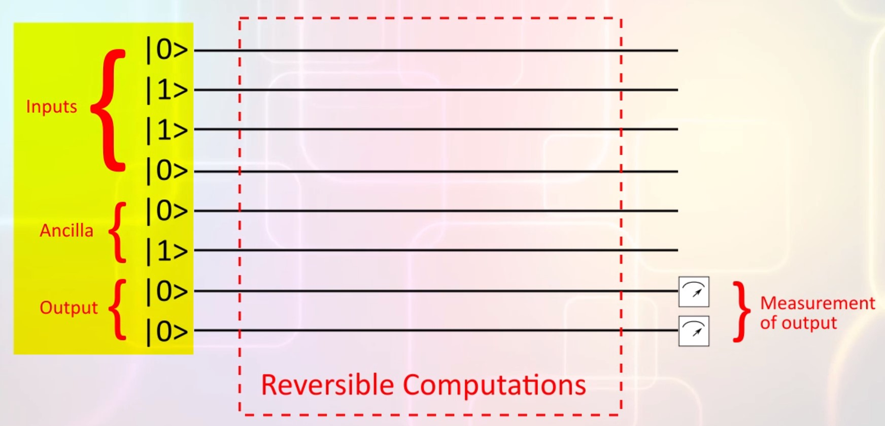
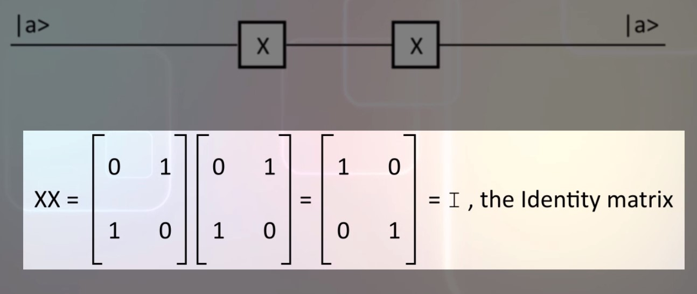

# Quantum computing model

## Quantum circuits
Quantum computation have to be reversible, but not everything is reversible. The initialization step where the qubits are set to 0 is irreverseble and so is the final measurement.  
The steps in between are reversible.  
  

The computation are shown on a diagram like this:  
  
The initial value of the bits are set on the left. This initialization is an irreversible operation and is performed before quantum computations begins.  
During the quantum computations, there can be no assignment of values to any of the bits (assignment is an irreversible operation).  
But if we can't assign values, how do we compute anything? The trick is to use xor onto a qubit that has been initalized to 0, whatever value we XOR with a bit that has been initialized to 0 will get that value.  
Here is a pattern that will be followed in many quantum computations:  
Suppose we have a computation that takes 4 bits of input and produces two bits of output.  
The four bits of input are initialized here to whatever the input value is:
```
qubit0 |0>--------------------------------------------------------------------
qubit1 |1>--------------------------------------------------------------------
qubit2 |1>--------------------------------------------------------------------
qubit3 |0>--------------------------------------------------------------------

qubit4 |0>--------------------------------------------------------------------
qubit5 |0>--------------------------------------------------------------------
```
For the output we XOR values onto the output qubits (q4 q5), so we initialize they with 0. When computation is completed we measure the last two qubits to get the answer.  

## Fanout
In electronic circuit diagrams, it is common to see a configuration like this:  
  
The output of the NOT gate is sent to the input of three separate AND gates. Implementing this in hardware is trivial just use a wire to connect the output of the NOT gate to the three inputs of the AND gates.  
Connecting a single value to multiple inputs is called **fanout**.  
But in quantum physics this can't be done.  
Recall the no-cloning theorem: we cannot clone an unknown quantum state, the output of a gate is an unknown state. We cannot feed this unknown state as an input to multiple gates further down in the computation.  
Feeding an output state to three inputs is the same as making 3 clones of the output state.  
Instead quantum computations use a special kind of gate called a **fanout gate** to copy the output to multiple subsequent inputs.  
Fanout gates copy qubits that are **1 or 0** exactly. But qubits in superposed or entangled states don't get copied exactly by these fanout gates.  

## Uncomputing
A qubit is a very expensive piece of hardware, most quantum computers have very few qubits. We will want to reuse qubits during computations.  
But in the circuit model of quantum computation we can't reinitialize a qubit.  
Instead we can reuse a qubit by reversing the computations that have been performed on it so that it returns to its original state.  
In this diagram:  
  
The actions performed by these gates on the ancilla (bits whose values are known a priori) bits are reversed after the target bit has been set.  
Reversing the ancilla bits back to their initialized state allow them to be used again later in the computation.  

## Reversible gates
Recall that only the first and the last step of a quantum computation are irreversible.  
The first step set up the initial values of qubits, this include:
- The input qubits
- The output qubits are initialized to 0 in this first step
- Ancilla qubit, we might need som reference qubits in a known state for our computation. Something like a reference constant.  


The entire computation can be represented as a diagram, the initialization step is on the left, the final measurement is on the right and in between we have some horizontal lines.  
Each horizontal line is the timeline for one qubit.  
Computation are performed by quantum gates that transform qubits, these reversible gates are represented on the diagram as boxes:  
  
A quantum gate that affects only one qubit is drawn over only one qubit, A quantum gate that transforms two qubits is drawn as a box that spans two of the horizontal lines.  
Observe an important difference between quantum gates and the digital circuits we saw in an earlier lesson: the number of outputs was less than the number of inputs but with quantum gates the **number of outputs is the same as the number of inputs**

## Quantum NOT
A NOT gate is represented on the computation diagram like this:  
  
Recall that reversible quantum operations are mathematically modeled as matrix multiplications, the not gate is this matrix:
```
| 0  1|
| 1  0|
```
Examples:  
  
Applying two NOT gates consecutivelly is like doing nothig:  
  

## Other single qubit gates
We have more possible single qubit gates because qubits can be in superposition, and we can do more with superposed states than just changing OFF to ON or ON to OFF.  

### Pauli operation
  
Observe that X is the same as the NOT gate.  
All of the Pauli operations are like the NOT gate in that they invert themselves:  
  

### S and T operations
  

### Square root of NOT
If we apply this operation twice, it is the same as this matrix which is the NOT operation  
  

### Hadamard H
  
This gate is interesting because it take a state like |0> or |1> and changes it to a superposition.  

## CNOT Gate
We arleady seen how 2 qubits system can be represented by a vector that has 4 elements.  
A gate that operates on 2 qubits will be modeled by a 4 by 4 matrix.  

The controlled NOT gate is a 2 qubit gate it is shown on a quantum circuit diagram with this symbol:  
  
The behavior of a controlled NOT is that |x> is the control.  
When x is 1 then the output down is NOT of y.  
When x is 0 then the output down is y.  
If we want to write the output without any "ifs" in it then we can say that the down output is x XOR y.  
The matrix model of the CNOT gate is:
```
| 1  0  0  0|
| 0  1  0  0|
| 0  0  0  1|
| 0  0  1  0|
```
Try to resolve:  
  
The result: 
```
M|00> = |00>
M|01> = |01>
M|10> = |11>
M|11> = |10>
```
The second qubit's value is controlled by the first qubit in this 2 qubit system.  
The CNOT gate **is the inverse of itself**.  

## CCNOT: Toffoli gate
What if you had a 3 qubit gate that is similar to the controlled NOT gate?  
  
Instead of one control qubit you have two controls and the third bit is inverted only if both the control bits are 1.  
This is the **Toffoli Gate**, the output can be written as z XOR (x AND y).  
You can see that the Toffoli is its own inverse by placing two gates one after the other like this:  
  
The final z output is z XOR (x AND y) XOR (x AND y) = z.  
Since this is a 3 qubits gate, the state vectors it operates on have 3 qubits.  
Three qubits in the system means there are 2 power 3 = 8 elements in state vector, some examples:   
  
The Toffoli gate's matrix model is the 8 by 8 matrix shown here:  
  
So far we have discussed a 2 input one output Toffoli gate, lets construct a 3 input one output Toffoli gate using the 2 input gate as a building block **CCCNOT**:  
  
The first Toffoli gate places an intermediate value in the |0> qubit, the intermediate value is used in the second Toffoli gate to obtain the final result in |w> qubit.  
Then we use the third Toffoli gate to restore the |0> state.  
In this case |0> is an **Ancilla bit**.  

## Universal Gate
Recall that in digital circuits the NAND gate is a universal gate, whit the NAND gate we can represent any logical expression as a digital circuit.  
Like the NAND gate the **Toggoli Gate** is a universal gate.  
### Toffoli as NOT
The Toffoli gate can be configured to behave as a NOT gate easily, just set both control qubits to 1.  
### Toffoli as AND
The Toffoli gate can behave as an AND gate if we set the third qubit to |0> and use the first two qubits as the inputs to the AND gate.  
### Toffoli as Fanout
We also need a mechanism to produce fanout, as said before we cannot feed the output of any quantum gate to more than one subsequent gate because of the no-cloning tehorem, here is the Toffoli gate configured to give us fanout:  
  
Observe the |y> input is now available as two separate output qubits.  

## Fredkin Gate
It is another universal quantum gate:  
  
The qubit |x> is the controller the two qubits |y> and |z> are controlled by x.  
When x is 0 the two outputs y and z remain the same.  
When x is 1 then y and z are swapped.  
Here the matrix for the Fredkin:    
  

## Effects of superposition and entanglement on quantum gates
We have discussed quantum gates with the implicit assumption that qubits will be either 0 or 1.  
Instead what if the inputs to a quantum gate is not 0 or 1 but is a superposition?  
Suppose we have a Fredkin gate configured like this:  
  
This is the fanout configuration. If x is 0 or 1 then the value of x will be replicated in two of the outputs, the first and the last qubits and NOT x will be available in the middle qubit.  

What if we set x to a superposition state?  
Lets set x = (1/root(2))(|0> + |1>):  
  
The result is an **entangled state** = ```(|010> + |101>)/root(2)``` so we can't separate the individual values og the qubits.  
The takeaway is that quantum gates are designed to be intuitive when qubits are 0 or 1, when the inputs are superposed or entangled the output can be weird.  