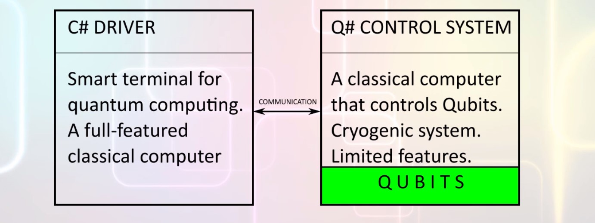
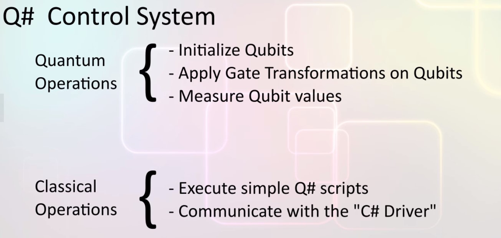
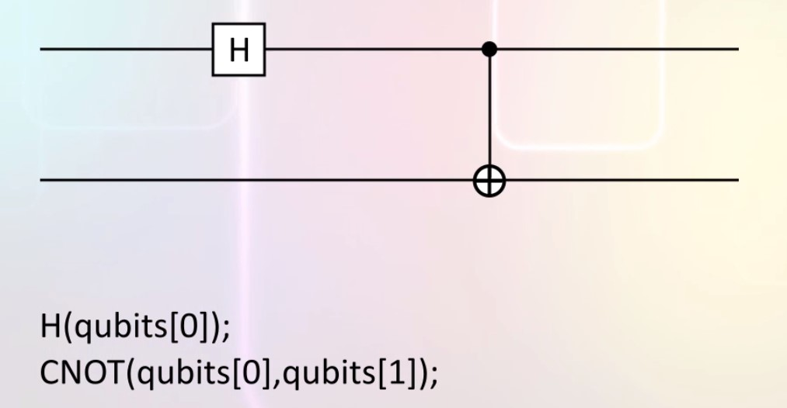

# Quantum programming with Microsoft Q#

## Installing Q#
Microsoft has released a quantum development kit to help software professionals develop quantum software.  
The kit includes a quantum computer simulator.
Install Visual Studio and add: 
- .NET core cross platform development
- F# development tools

Next download and install the quantum development extension from this url: https://www.microsoft.com/en-us/quantum/development-kit

## Q# simulator hardware architecture
Microsoft Q# is a special language developed by Microsoft to control quantum computers.  
  
It is designed for this quantum computer architecture:  
There is a regular classical computer which interacts with humans prints to screen gets input, reads and writes files to disk and so on.  
The classical computer is connected to the quantum computer.  
The quantum computer can be thought of as a co-processor or as a cloud computer which is accessed through this smart terminal.  
The quantum computer perform quantum computations and sends measurements of qubit values back to the classical computer.  
The classical computer is programmed through microsoft's c# programming language.  
The quantum computer is programmed through Q#.  

The **architecture** of the quantum computer is like this:  
There is a classical control system which controls qubits.  
The control system performs operations on the qubits.  
  

To summarize the architecture is like this:  
The classical computer colelcts inputs, software here is written in c# it is called the driver, then the input data is sent to this quantum computer, it consists of a classical control system which manages the quantum bits, it is programmed with q#.  
The q# codes collects the input from the driver, initializes the qubits, applies gates on the qubits and finally measures the final states of the qubits.  
The data collected from the qubits is then sent back to the driver software.  

## Q# control system
The control system itself behaves like a classical computer, software for the controller can have variables, for loops, function calls and other features found in languages for classical computers.  
The main difference is that in addition to classical operations it also have a library of operations that control the qubits.

## Q# execution model
Considere this quantum circuit:  
  
We have two qubit we apply a hadamard gate on the first qubit to place it in super position, then we apply a CNOT operation on both qubits.  
This can be represented in q# by this code:  
```q#
H(qubits[0]);
CNOT(qubits[0], qubits[1]);
```
It is sequential! The speed up of quantum computing comes from the ability of qubits to be in superposed and entangled states not from their ability to perform operations in parallel.