# How is quantum computing different?
Quantum computing builds on weird quantum behavior.The idea of a bit is different: A quantum bit is not just OFF or ON, it can be in superposition.
Bits are not independent of each other, they can be entangled.

## Quantum computing architecture
There is a Foundamental difference in the way we program QCs, it is not based on the Von Neumann architecture. Von Neuman architecture is the idea that theire is a CPU which perform computations on data stored in memory.  
CPU + Memory model doesn't apply to quantum computers.  
Quantum computers are designed like a digital circuit with gates, instead of bits, the gates operate on quantum bits (**Qubits**).  
The qubits are not independent they can be superposed and entangled with each other, superposition and entanglement requires us to rethink algorithms in a fundamental way. Programming quantum computers involves Math.  

# Quantum Cryptography

## Photons
This protocol is based on the quantum properties of light, light is a stream of photons, a photon behaves like a particle but light is also an electromagnetic wave.  
It is a transverse wave, that means the electric and magnetic oscillations are at right-angles to the direction of propagation of the wave:
  
Suppose we shine light along z-axis, the red arrow rapresent light, then the elctro-magnetic oscillations are at right-angles to the z-axis, this mean the electro-magnetic oscillations are along the X-Y plane. The green arrow rapresent one of possible direction of oscillations. All of these are perfectly valid directions for oscillations because they all lie on the XY plane. Each photon tat is directed along the Z-axis has its own angle, this angle is called the angle of polarization.  
To summarize, a photon has a property called polarization angle.  
Usually we discuss photon polarization from the poin of view of light source, fromn this point photons always travel away so polarization can be vertial or horizontal or some angle in between

## Photon polarization
There is something called polarizing filter:
  
A polarizing filter allows photons of light to pass through if the polarization of the light is the same as the polarization of the filter. A polarizing filter looks like a sheet of plastic:
- It is transparent to photons with the same angle of polarization as the filter. 
- It is opaque for photosn wich are polarized at 90 degrees to the filter (vertically polarizing filter is opaque for horizontal polarized light beam).  

If we pass a polarized photon through a polarizing filter then the photon behaves in a quantum-mechanical manner.  
Suppose the polarizing filter is vertical, it allows vertically polarized photons through. We can send any number of photons that are vertically polarized at the filter and all of them will make it through.  
Instead, suppose we send photons that are horizontally polarized, for this photons filter is opaque, none of the photons make it through.
  
Suppose we send photons that are polarized at 45 deg, 50% of the photons will go through the filter and the rest will be blocked. Thsi is purely random behavior.  
We cannot say which photon will pass through and which will not, if the photon is polarized at 45 deg then it has a 0.5 probability of passing through the filter.
Furthermore, all the photons that make it through the filter will be vertically polarized, remember all the photons we send to the filter started out polarized at 45 deg.
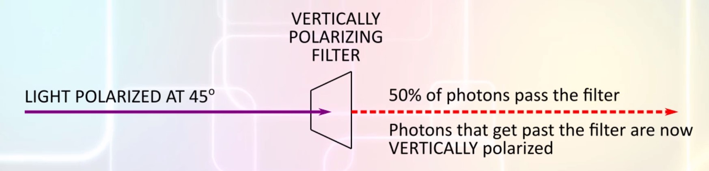  
This illustrates a foundamental idea in quantum physics: measuring a property of a system changes the system. In this case the measuring apparatus is the polarizing filter and the photons is the system being measured. Measuring the polarization angle of a photon using a filter changhes the polarization of the photons when it makes it past the filter.

Observe that when the measuring apparatus is aligned in the same direction as the property being measured then there is no randomness: 
- When the polarizing filter is at the same angle as the photon all the photons pass through, there is no randomness **DETERMINISTIC BEHAVIOR**. 
- When the polarizing filter is alighet at 90 deg to the photons all the photons are blocked, there is no randomness **DETERMINISTIC BEHAVIOR**.
- When lisght is polarized at an in-between angle, a fraction of the photons get through  **PROBABILISTIC BEHAVIOR**. Photons that pass the filter are polarized at the same angle as the filter.

## Experiments with photon polarization
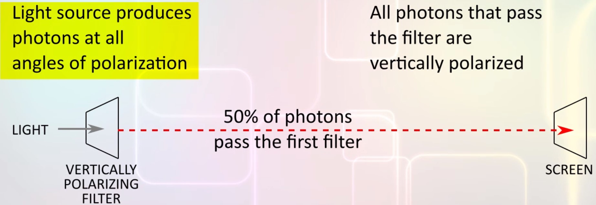  
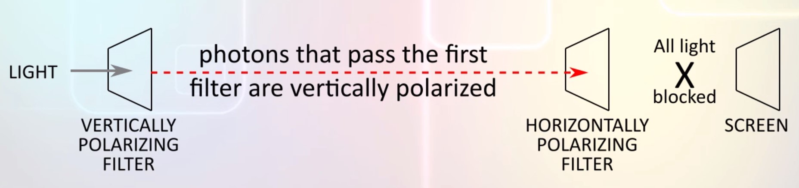  
  
This experiment proves that polaring filter are not really filters, they are **quantum mechanical measurement devices**. Quantum measurements change the state of the systems being measured.

## No-Cloning theorem
Given a quantum system with an unknown state, we can't measure more than one property of the system. This is because the first property we measure will change the state of the system so the subsequent measurements are actually measuring a different system.  
One possible work-around might be to clone the system then we can measure a different property of the system from each clone.
  
Unfortunately, this scheme cannot work. It is physically impossible to clone an unknown quantum system this is called the **no-cloning theorem**.  
If you know all the system's parameters you can still make identical instances of a system with those parameters but if a system's parameters are unknown, you cannot clone it.

## Encoding with XOR
Foundamentals idea:
- Any measurement of an unknown system changes the system being measured
- No cloning: Can't clone an unknown system
- When the measuring apparatus is aligned at the same angle as the system, the system is not changed by the measurement

The interesting thing abount XOR is that if you XOR the same set of bits again, you get back the original:


## Encryption with single-use-shared-secret
Suppose Alice wants to communicate with Bob if they both share a secret sequence of bytes that is longer that the message tey want to communicate then Alice and Bob can communicate securely.  
Alice first XORs her message with the shared secret sequence and sends it to Bob, he XORs the secret sequence again and recovers the message sent by Alice.  
If the shared secret is a random sequence of bytes and if **each shared secret is used only once** then this code is unbreakable.  
So now the problem is to securely establish a shared secret sequence of bytes.

## Encoding data in photon polarization
Alice and Bob are connected by two channels of communication, both are potentially insecure. 
- There is a classical channel for communication, something like internet or radio, anyone can eavesdrop on this channel. 
- There is a quantum channel where Alice can send Bob polarized photons


  
Alice first creates a long sequence of random bits, now she needs to send it to Bob in a secure manner. Once he receive the bits they can use it as a shared secret in some future communication between themselves.  
The important thing is not all of the bits which Alice has created here will be in the final shared secret, a random fraction of these bits will be lost during transmission when we apply the BB84 protocol so only a fraction of these bits will reach Bob and become the shared secret.  
Moreover, neither Alice nor Bob will be able to control which bits are corrupted during transmission, the process is random.  

Lets supposse that Alice encodes the bits with vertical and horizontal polarization this way:
- Vertical polarization   -> 1
- Horizontal polarization -> 0

Unfortunately, anyone eavesdropping on the quantum channel can read the data being sent without either Alice or Bob realizing that their security has been compomised.  
Suppose Eve wants to eavesdrop:
- Measure photon with polarizing filter
- Decode bit-value of photon.
- Create new photon for the same bit value
- Send new photon to Bob

Observe that Eve was able to "read" the photons because she knew that by aligning the polarizing filter vertically there would be no randomness.  
But if Eve didn't know how to align the filter she wouldn't be able to read the data reliably.  

## Making the protocol secure
To prevent eavesdropping, Alice modifies her protocol, Alice chooses to encode a randomly chosen 50% of the bits in her sequence the same way as before. But for the other 50% Alice encodes:
- 45 deg right polarization -> 1
- 45 deg left polarization  -> 0

The choice of which encoding to use for each bit is made at random, there is the 50% probability that Alice will chose the vertical/horizontal encoding and the rest 50% probability with 45 deg encoding. 
Bob who is receiving the photons doesn't yet know the encoding that was used for each bit. Since Bob doesn't know, he makes random guesses, 50% of the time he guesses correctly
and 50% of the time he guesses wrong.
When the polarizing filter is not aligned with the angle of polarization of the photon the behavior of the photon is random.  
So Bobs's attempt to decode these bits using his wrong guesses result in a random set of bits.
This are the 50% bits are the ones that get corrupted and are lost in transmission.  
(+: vertical/horizontal, X: 45 deg, -: horizontal, |: vertical, \: 45 deg left, /: 45 deg right)
  

## Exchangig polarization angles
Alice has another way to communicate with Bob, the classical channel here, after Bob has received all the photons sent to him he lets Alice know through this classical channel.
Alice then sends him the encoding she used for each bit through the classical channel. Observe that Alice doesn't send the bits themselves she only sends the encoding she used.  
Whit this information bob knows which bits had been correctly decoded by him and which ones were wrongly decoded, Bob also send Alice his guesses on the angle of encoding. So both know the bits where Bob guessed correctly and where he guessed wrong.  
Both Alice and Bob discard the bits for which Bob made wrong guesses and retain correct guesses.  
The bits for which Bob guessed the encoding wrong are corrupted and lost the others are their shared secret using the XOR.

## Why is the BB84 protocol secure
The key idea here is that Alice reveals the encoding to Bob only after Bob has received all the photons. If instead, Alice had messaged the encoding to Bob earlier, then Eve could have eavesdropped. With prior knowledge of the encodings  Eve could have aligned her eavesdropping apparatus to decode each bit as it was sent and then resent the bits to Bob.  
But in this protocol, Alice reveals the encodings only after Bob has received the photons. This is too late for Eve to use in eavesdropping. Instead, if Eve tried to eavesdrop by guessing the encodings, there will be randomness in the measurements caused by wrong guesses. Eve's attempt to eavesdrop will corrupt some of the bits sent to Bob. Alice and Bob ca detect that some bits have been corrupted by exchanging a checksum trough the classical channel.

## Analysis
We now have a protocol that allows Alice and Bob to share a secret key over insecure communication channels. Once they have a shared secret Alice and Bob ca use a 1-use-shared-secret encryption wich is unbreakable.  
The security of the protocol is based on quantum behavior of photons.  
The law of physics don't change when we develop new technologies, so this protocol will remain secure in future. Thi is important because RSA was consider secure until it was shown that quantum computers can crack RSA encryption.  

# Foundation: Complex Numbers, Probability, Linear Algebra & Logic

## Probability
Probabilities add up to 1
  
If probability of picking an apple is x then probability of picking an orange is 1-x.  
Another thing to remember is that though final probabilities are always positive numbers between 0 and 1, intermediate values in computations can be negative.  
```P(A or B) = P(A) + P(B) = P(A) + P(B) - P(A and B)```

## Complex numbers
While solving equations, we often come across equations like this: x^2 = -1. Clearly there is no suck x, it doesn't make sense to say that x squared is -1 if x were a number that we were going to use in the real word. But sometimes we are calculating intermediate values that are going to be processed further in some way before being used in the real world.  
Perhaps x means "square root of the correction factor", in that case saying x squared = -1 makes sense.  
x squared is the correction factor and that is -1. If we have defined x as the square root of the correction factor then we need some way to write the value of x and perform computation on it.  
The square root of -1 is an imaginary quantity and we give it a name **i** so we can talk about it as though it were a real quantity.  
Any nth root of any negative number can be written in terms of **i**: ```a + bi```
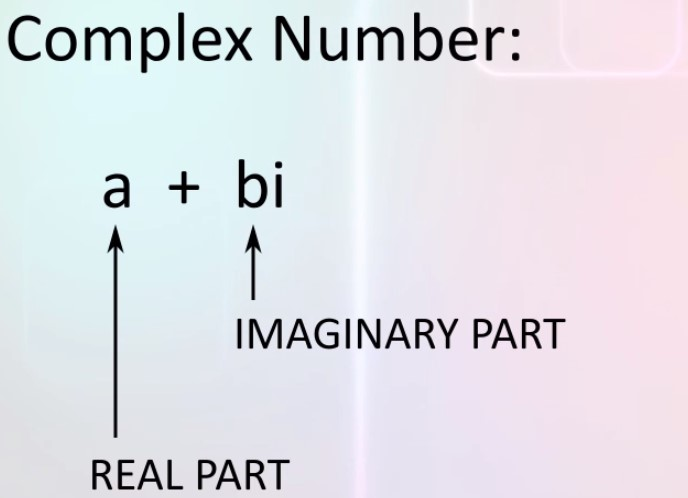  
Any nth root of a complex number is also a complex number.  
Complex numbers are the foundation of quantum physics

You can multiply, divide, add and subtract complex numbers just like you would real numbers.  
**Add or subtract:**  
  
**Multiply**  
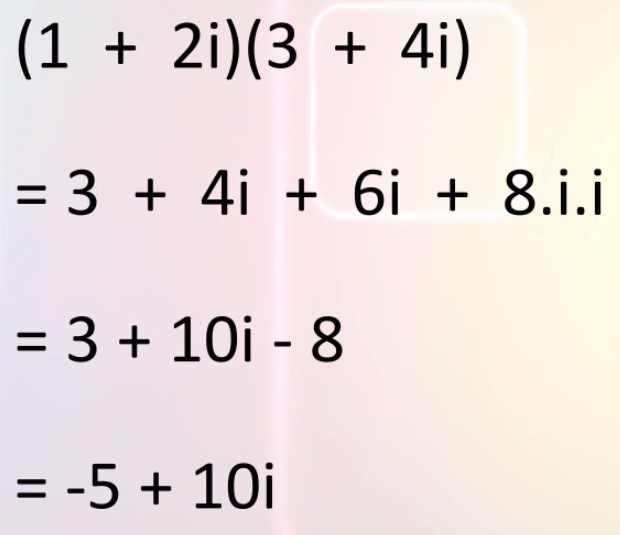  
If you see an i squared you can replace it with -1  
**Division**  
Division is a little tricky, to divide complex numbers, we need to know about complex conjugates.  
Suppose to hav a complex number ```a + bi```, if you change the sign of the imaginary part then you get the **complex conjugate**.  
Now lets learn how to divide, the trick is to multiply the numerator and denominator by the complex conjugate of the denominator.  
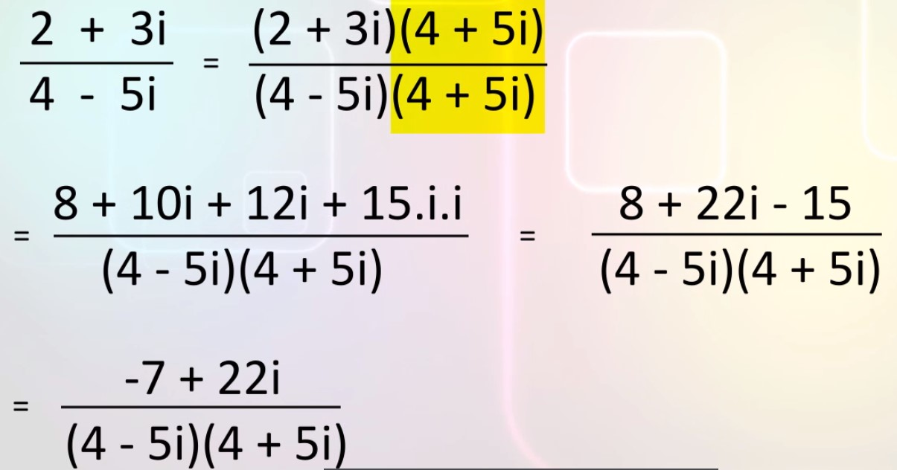  
  

NB: if you multiply a complex number by its complex conjugate you always get a positive real number called the square magnitude of the complex number that is the square of the real part plus the square of the imaginary part

## Matrix algebra
A matrix is a table of numbers arranged in rows and columns.  
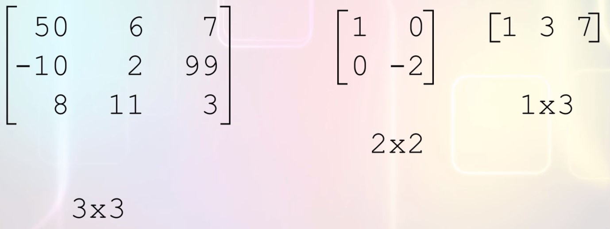  
The dimension is describet with: ROWS x COLUMNS.  
### Multiply by a scalar number
We can **multyply any matrix by a scalar number**. Like this:  
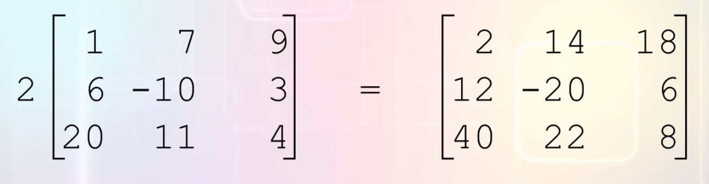  
We just multiply each element in the matrix by the scalar.  
### Addition subtraction with the same dimension
If matrices has the **same dimension** then they can be **added or subtracted**. Like this:  
  
Each element is added or subtracted from the corresponding element.  
### Transpose
We can also perform an operation called **transpose**. The transpose of a matrix is a new matrix we get by exchanging the rows and columns. Visually this is the same as flipping the matrix around the diagonal.  
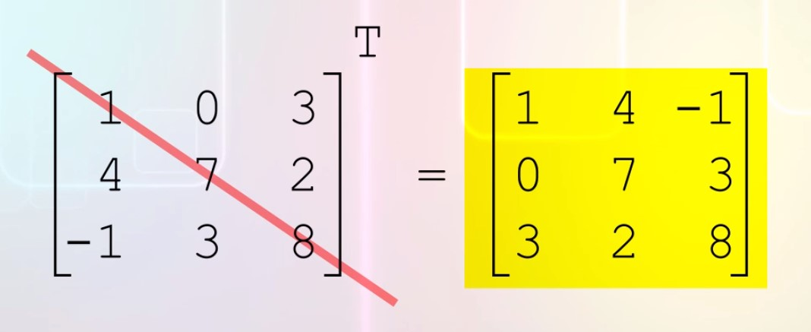  
Observe the way the matrix is mirrored about the red line. Transpose is possible even if the matrices are not square. 
### Complex conjugates 
If the matrix **has complex numbers** you can find the complex conjugate of the entire matrix by taking the conjugates of each element.  
  
### Adjoint
If we calculate the complex conjugates and transpose the matrix we obtain an operation called **adjoint**.  
  

## Matrix multiplication
Matrix multiplication **it is not commutative**. If A is a matrix and B is a matrix then AB is different from BA.  
Whit the multiplication the rule to determine if two matrices can be multiplied is different.  
If matrix A is of dimension x by y and B is of dimension y by z then it is possible to compute AB.  
```If the number of columns in A is the same as the number of rows in B then the product AB can be computed```  
Suppose to have matrix A and B  
```
|  1   7   8|   |  2   9   3|
|  3  -1   2| x |  8   5   6|
| 11   9   4|   |  1  -3   1|
```
Take the first row of A multiply each element in this row with the corresponding element of the first column of B: (1x2) + (7x8) + (8x1) = 66  
Take the same first row of A multiply the second column of B, this become the element in the second column of the first row: (1x9) + (7x5) + (8x-3) = 20.
Similarly, multiply the first row of A and the third column of B
```
| 66  20  53|
|  0  16   5|
| 98 132  91|
```

## Identity matrices
The identity matrix is always a square matrix but the number of rows and columns can change.  
In the identity matrix all the elements in the diagonal from the top-left to the bottom-right are 1, the other element are all 0.  
We call it identity matrix because when it is multiplied by a second matrix, the result is the same as that second matrix.

## Asimetric matrices multiplication
The result of a matrix multiplication is the number of rows in the first matrix by the number of collumns of the second matrix.

## 1x1 matrix
Lets multiply this 1 by 3 matrix and this 3 by 1 matrix the result ought to be a 1 by 1 matrix.
```
             | 4|
| 1  2  3| x | 5| = |32| = 32
             | 6|
```
When we get a 1 by 1 matrix as result, in quantum mechanics, we treat it like a scalar

## Logic circuits
**AND Gate**  
  

**OR Gate** 
  

**NOT Gate** 
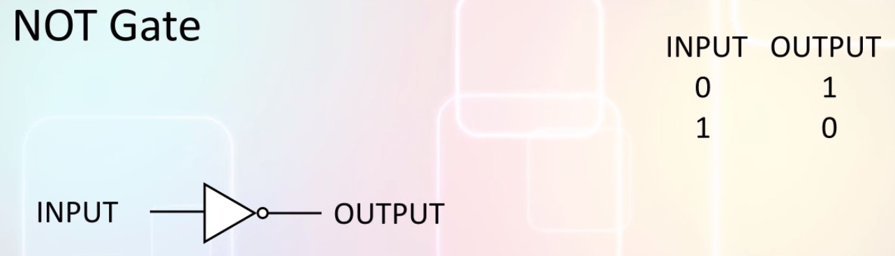  

**NAND Gate**
  
In ters of hardware, the NAND gate is a universal gate, whit just this one kind of gate we can build any kind of logic circuit. We don't need 3 kinds of gate hardware.  

If we connect the inputs of the NAND gate toghether then the NAND gate behaves like a NOT gate:  
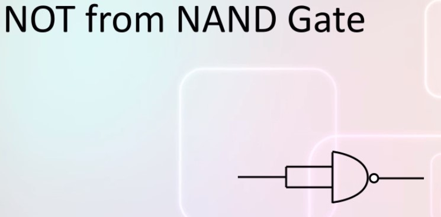  
If we connect this NOT gate to the output of a NAND gate, then the two NAND gates toghether behave like an AND gate:  
   
If we connect the NAND gate like the configuration below, we get an OR gate:  
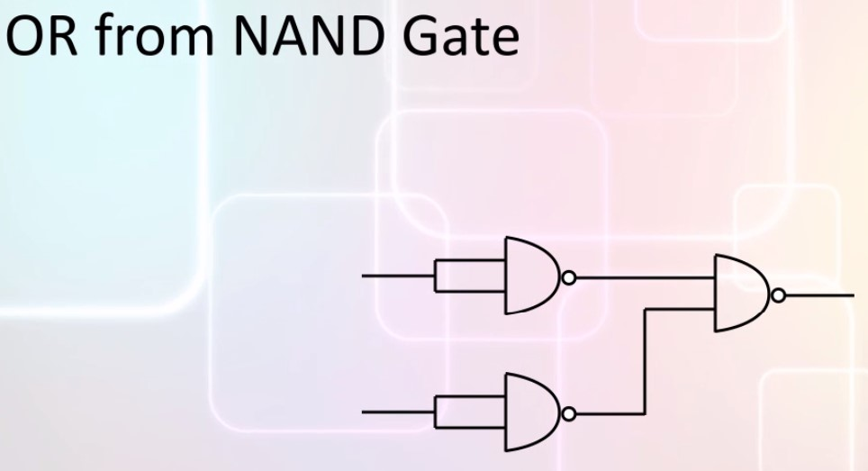  

# Developing a math model for Quantum physics

## Subtractive probabilities through complex numbers
Quantum physics is based on probabilities, but what kind of probabilities?  The double-slit experiment offers some clues about the kind of mathematical model we need.  
The bouble slit experiment uses apparatus like this:  
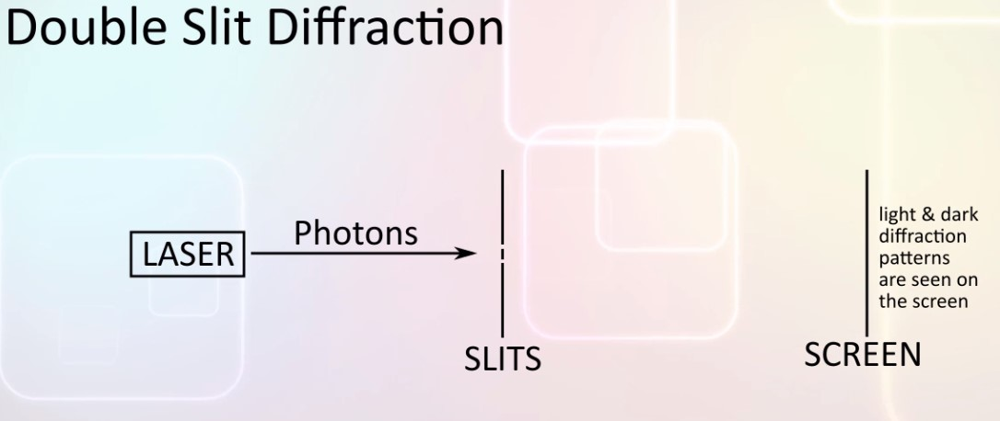  
There is a light source (the laser), the light is directed at an opaque sheet that has two parallel narrow slits placed very close to each other. Light can pass through the slits.  
There is a screen on the far side of the slits.  
We se an interference pattern on the screen, a series of light and dark vertical bars.  
The classical way to explain the interference pattern is to say that light can also behave like a wave. In contrast of classical physics quantum mechanics uses probabilities to model the interference pattern.  
Explained in term of probabilities the bright spots are where the brobabilities add up, the dark spots are where the probabilities cancel out.  
This gives us a clue about the mathematical model we need for quantum mechanics:  
Probabilities need to be able to cancel out.  
That is, some probability terms will need to be subtractive.  

Physicists have also found that many of the formula in quantum mechanics operate on the square root of the probabilities. Since probabilities can be subtractive when we compute square-roots we can end up with square roots of negative numbers (complex numbers).  
The mathematical model we need for quantum mechanincs will use complex numbers to represent square roots of probabilities.  

## Modeling superposition through matrices
The simplest quantum system is the **Qubit,** the quantum equivalent of the **bit** we use in classical computers.  
```The qubit can be in state "off" or in state "on" or a "superposition" of off and on.```  
This give us another clue about the kind of mathematical model that will be suitable for quantum mechanics:  
```A system in superposition requires more than one number to define it.```  
We will need a collection of numbers to define a quantum system in superposition.  
A mathematical tool to work with collections of numbers is _matrix algebra_ also known as _linear algebra_ 

## Overview
Putting all the clues together, we see that quantum states are represented by colum matrices of complex numbers.
```
|(a+bi)|
|(c+di)|
|(e+fi)|
```
Changes to this state are represented by multiplying the column matrix by a transformation matrix:  
  

A quantum state without superposition is represented by a single number in the column matrix, all others are 0.  
Square magnitudes of the numbers in the column matrix represent probabiliies.  
Square magnitudes of the complex numbers in the column matrix add up to 1.  
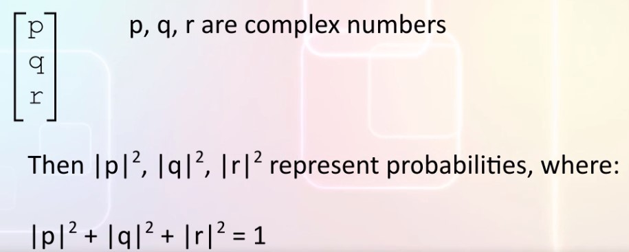  

# Quantum physics of spin states

## Introduction to spin states
When electrons move in a magnetic field, they are deflected as though they were little magnets.  
Electrons could behave like little magnets if they were spinning, in reality electrons are not spinning like little tops but the name has stuck.  
This magnetic property of electrons is called spin.  
The **spin** can be measured to be up or down, it is the only measurement that can be performed on spin.
The spin can be used as the quantum equivalent of a "bit":
- Spin "UP"   -> Quantum bit in state 1
- Spin "DOWN" -> Quantum bit in state 0

## Basis
We need a base to describe the spin quantum state. In Newtonian physics, we use the three axes x, y and z to describe location and motion in 3 dimensional space.  
The three axes form the basis for classical mechanics.  
The analogous basis for a spin qubit could be **UP** and **DOWN**.  
What makes this a good basis? These properties:  
Once a spin has been measured as **UP**, the probability of it being measured subsequently as **DOWN** is 0; similarly once a spin has been measured as **DOWN** the probability of it being measured subsequently as **UP** is 0.  
This mean that **UP** and **DOWN** are orthogonal.  
Furthermore, when measured, the spin is either up or down.  

In our mathematical model, we will represent the quantum state of a qubit by a column matrix with 2 elements:
```
Spin down state    Spin up state
     | 1|              | 0|
     | 0|              | 1|
```

## Column matrix representation of quantum state
In quantum physics, the number which descrive a state are written as a column matrix, a column matrix is called a **VECTOR**. To avoid confusion remember that a ector in quantum physics is jus a column matrix. It has nothing to do with the classical physics vectors like velocity that have a magnitude and a direction.  
A vector which represents a qubit has two elements: 
- The upper number is the square of the magnitude of the number of the probability of being measured in the _qubit-off_ or _spin-down_ state
- The lower number is the square of the magnitude of the number of the probability of being measured in the _qubit-on_ or _spin-up_ state

  
Since the two numbers in the column matrix could be complex numbers the square magnitude is computed by squaring the real part and adding it to the square of the imaginary part.  
Square magnitudes of all the complex numbers in a state vector add up to 1.  
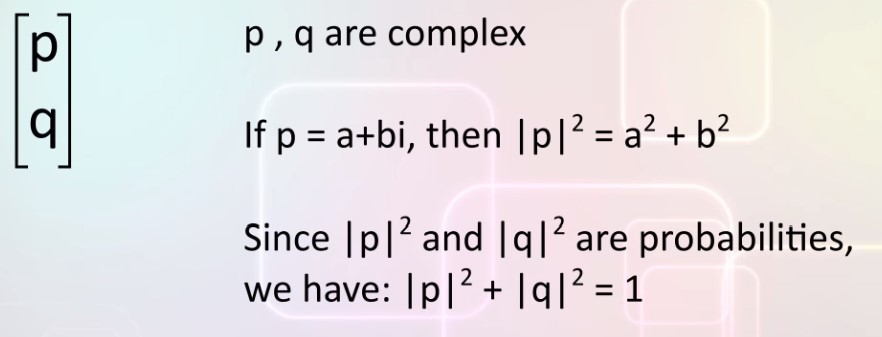  

## State vector
Consider the below vector, if a qubits in this state were measured, the probability of the qubit being measured as OFF ir spin-down is 0.5 and the probability of the qubit being measured as ON or spin-up is 0.5.  
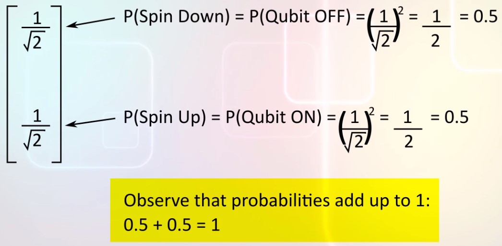  
If an element of the vector is 0 and the other 1 we say that the behavior is **deterministic** and not **probabilistic**.  
Apparatus for measurement is not always aligned in the UP or DOWN directions, when the it is aligned in a different direction even states like [0 1] and [1 0] will produce probabilistic measurement results.  
Another idea we will see is that measurement changes the state of a qubit.  
The first measurement of an unknown qubit state produces probabilistic results.  
But this measurement changes the state of the sustem being measured so that subsequent measurements produce deterministic result

## Experiments with spin 1
Whe have an apparatus for measuring spin, lets align the apparatus vertically along the z-axis. The apparatus will measure an electrn's spin and report UP or DOWN.  
Recall from previous, when we measure a system the system is changed by that measurement.  
Suppose we have a randomly chosen electron with an unknown spin since we have randomly chosen the electron the spin is likely to be a superposition of up and down.  
When we measure the spin with our apparatus will either be UP or DOWN, the measurement cannot report a superposition state.  
Suppose the apparatus reports UP: we don't know what the state of the electron was before the measurement but after the measurement we know that the state is now UP. In all the subsequent measurement our apparatus reports UP.

## Experiments with spin 2
The first measurement changes the state of the system, so that subsequent measurements are deterministic and the result of subsequent measurements is the same as the first measurement.  
Ok so now we have an electron whose psin has been measured to be UP by our apparatus, for each subsequent measurement using the same apparatus the result continues to be UP.  
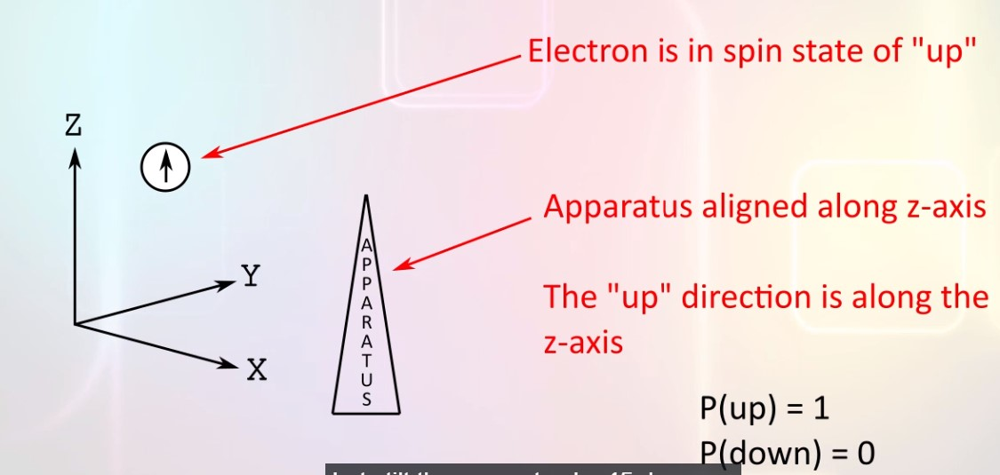  
Lets tilt the apparatus by 45 degree  
  
We don't actually perform a measurement because that would change the spin state of the electron, instead we just asking an hypotetical question: What would happen in this arrangement?  
There is an high probability that the measurement apparatus will report UP but now there is a definite non-zero probability that the apparatus will report DOWN.  
What if we tilt the apparatus further so that it is horizontal?    
  
Again we don't actually make any measurement. If we actually measured using the apparatus, then the spin state of electron will change, so in this case, for the hypothetical question, the apparatus will report UP with a probability of 50% and DOWN with a probability of 50%.  
What if we tilt it more?    
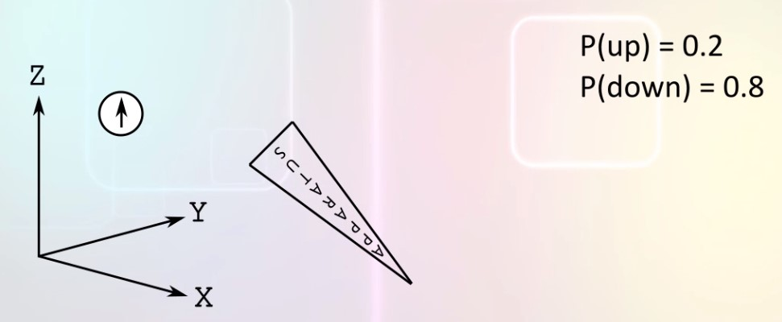  
This apparatus will measure DOWN whit 80% probability and UP whit 20% probability.  
If we turn the apparatus all the way upside down, then the apparatus will always report DOWN.    
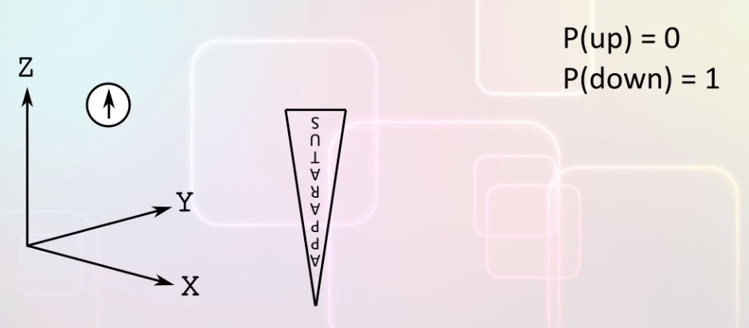  

## Experiments with spin 3
Lets rotate the apparatus to the horizontal position, and then we make a measurement:    
  
Recall that any measurement that is not aligned with the electron's current state will change the electron's spin state. So this measurement will change the spin state of the electron.  
The measurement will yield either up or down with equal probability.  
Lets suppose the apparatus measures DOWN, after this measurement the electron spin state has changed:    
  
Next lets rotate the apparatus back to its original position, if we measure the electron spin now it will be either up or down with equal probability, this is because the electron spin is now horizontal

# Modeling quantum spin states with math

## Analysis of Experiments
A state of a quantum bit can be represented as a vertical column matrix with two elements:
```
| p| <--- Square root of P(down)
| q| <--- Square root of P(up)
```
Now we are gogig to be more precise about these probabilities, every measurement on a system affects the system so we can think of measurement as a transformation of the system.  
In quantum physics every transformation is modeled by a matrix multiplication on the state-vector of the system.  
Lets consider the situation at the beginning of our experiments:  
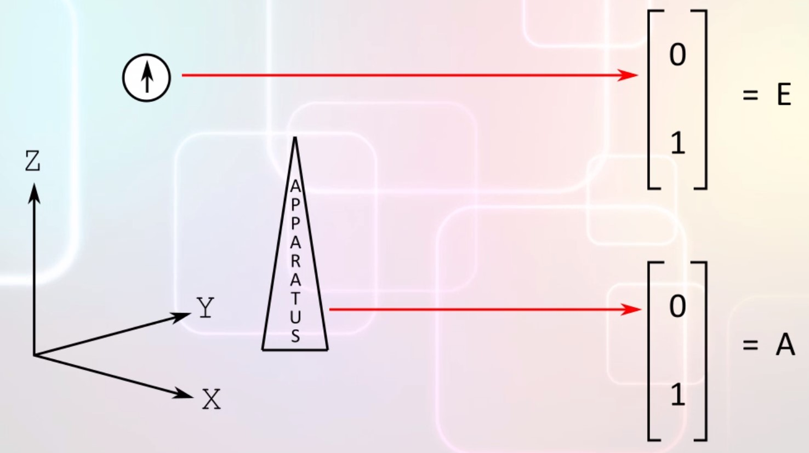  
We have completed one measurement, the spin was measured as UP. Matematically the spin of the electron is in the state:
```
| 0|
| 1|
```
The measurement apparatus is als vertically aligned pointing up:
```
| 0|
| 1|
```
A fine point about this measurement apparatus, it measures if the state of the electron spin is up or not, the result of measurememnt is _UP_ or _NOT UP_, it doesn't actually measure DOWN directly.  
Matematically if the apparatus were to measure DOWN its vector would be 
```
| 1|
| 0|
```
To compute the probability of our measurement apparatus obtaining UP from the measurement, we need to take the inner product of the measurement vector with the electron's state vector.  
- Take the complex conjugate of the apparatus vector
- Take the transpose
- Matrix multiply the two vectors

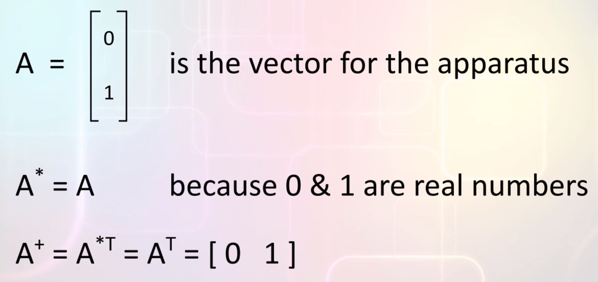  
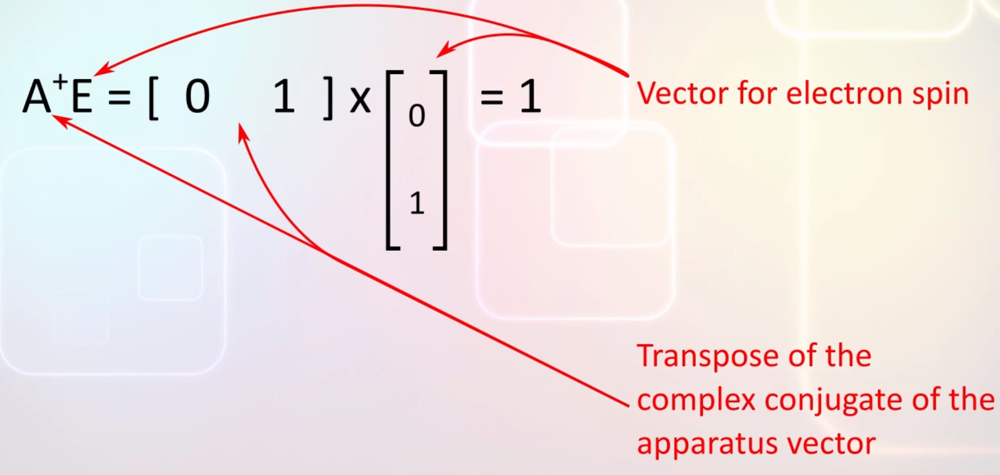  
The result is 1, the square of this number is the probability that measuring the spin of the electron with the apparatus will produce a measurement of UP.  
The probability is 1 means that every measurement will yield UP, the result is deterministic not probabilistic.  
Recall that the state of the spin was [0 1] after the first measurement.  
This math explains why every subsequent measurement aslo yield UP

One thing to observe is that the measurement changes the state of the system regardless of the kind of apparatus you use.  
The system isn't changing because we don't know how to make an apparatus that doesn't affect the system being measured.  
The idea that every measurement changes the state of an unknown system is an integral part of the laws of quantum physics.  
The math model tells us how the system is changed when we make a measurement, it is not possible to contruct any alternative apparatus that measure without changing the system.

## Dirac Bra-Ket Notation
Dirac developed a special notation for inner products called the Bra-Ket notation. The calculation we did before looks like this:  
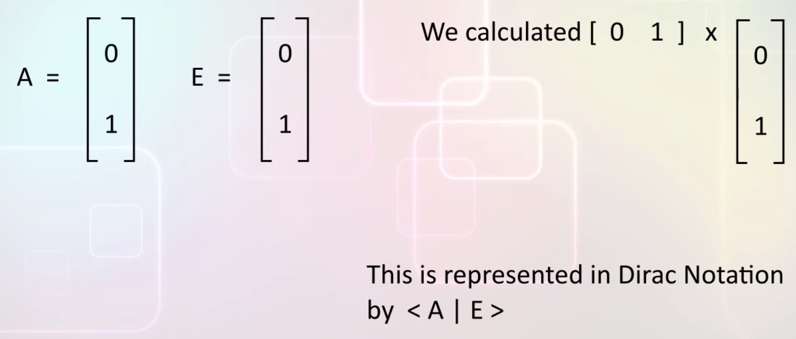  
(A: vector of apparatus, E: vector of electron spin)  
The Bra-Ket can be written in two parts: the Bra <A| and the Ket |E>.  
The Ket operator refers to the vector itself with no changes, the Bra operator refers to the transpose of the complex conjugate (**adjoint**) of the vector.  
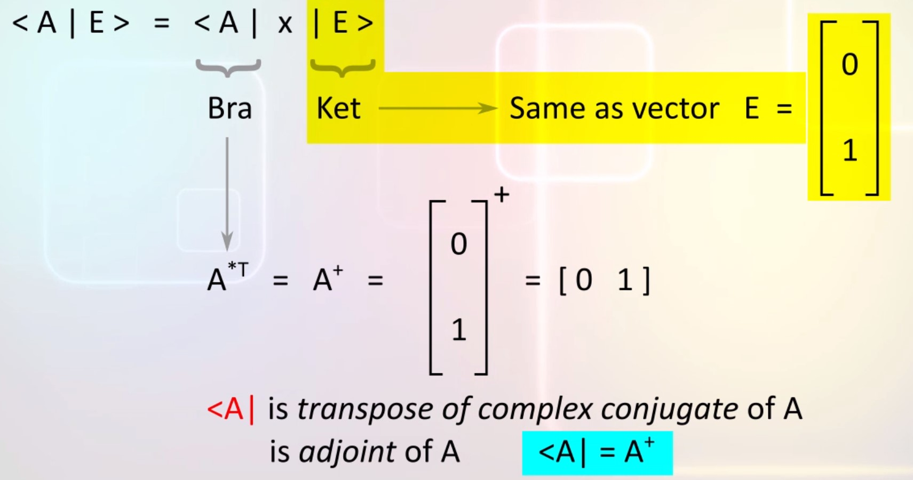  

The Bra-Ket can also be used to write the qubit vectors in algebraic expression without using matrix notation:  
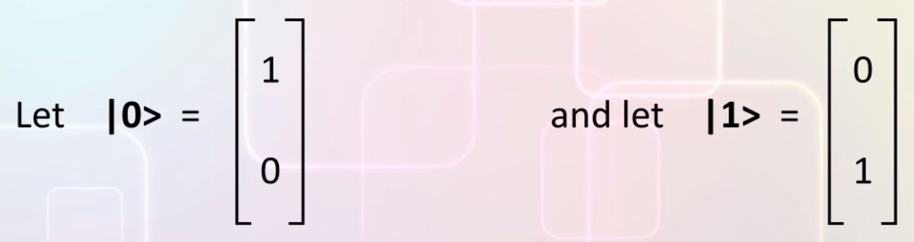  
The vector **[1 0]** represent the qubit being in the OFF state lets call it **|0> (Ket 0)**  
The vector **[0 1]** represent the qubit being in the ON state lets call it **|1> (Ket 1)**  
Then a vector in superposition [1/root(2) 1/root(2)] can be written as 1/root(2)(|0> + |1>)  
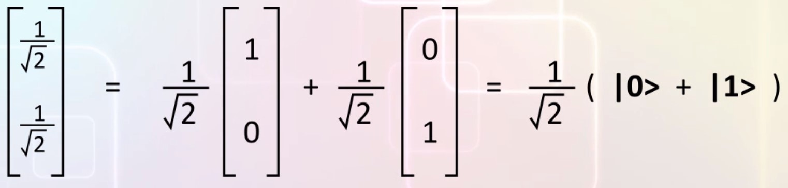  
Remember that |0> and |1> are just names for vectors.

## Experiment analysis
Returning to our spin experiments:  
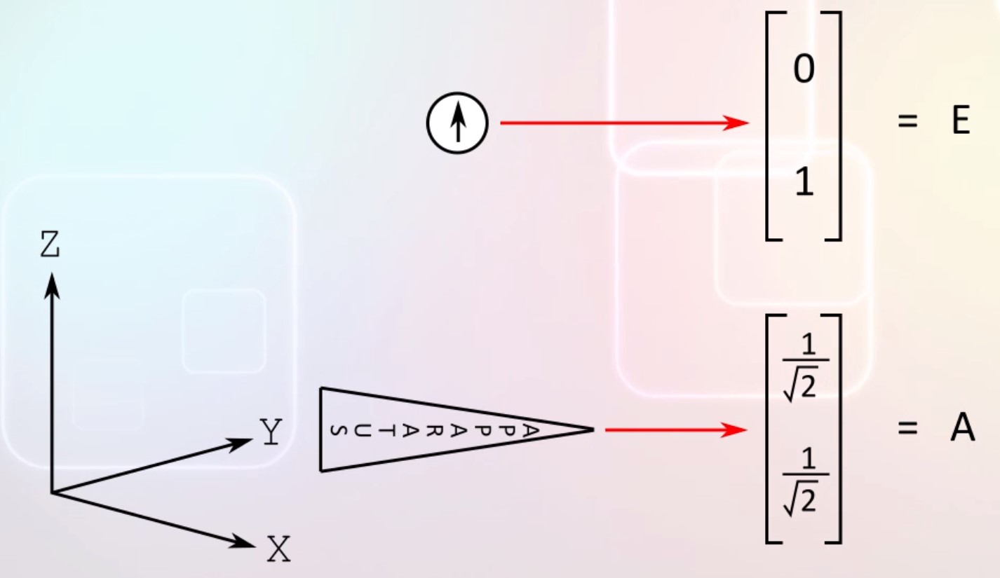  
The apparatu vector reflects the new orientation, how did we get this vector? Well we know from experiment what the probability of measuring UP or DOWN will be when the apparatus is oriented horizontally, this vector makes the math work.  
Now lets compute <A|E> with the new value of A:  
  
```P(UP) = <A|E><A|E> = 0.5```  
The square of the result numer is 1/2, so the probability that the apparatus will obtain a measurement of UP is 1/2.  

After the measurement the electron spin state changed and it is now pointing in the opposite direction to the apparatus:  
    
Instead, if the horizontal measurement had been UP, then the new state vector of the electron spin would have been the same as the apparatus.  
Intuitively, you might have thought that the opposite direction to the [1/root(2) 1/root(2)]T vector would be -1 x the vector but that is NOT correct.  
Lets pause for a moment and think about what it means for a state vector to represent an opposite direction in the physical world.  
Suppose an electron spin's state is represented by vector E and an apparatus by vector A.  
If A is pointing in exactly the opposite direction to E then in terms of measurement probabilities the probability of the apparatus measuring UP is 0 that is, the apparatus will always measure DOWN.  
In terms of matrix products, this means that ```P(UP) = <A|E><A|E> = 0 so <A|E> = 0```.  
To rephrase that: **if** two state vectors X and Y represent the **opposite directions** in the physical world **then** in terms of matrix products **<X|Y>=0**.  
Now lets return to the experiment, the apparatus state vector is [1/root(2) 1/root(2)]T, the electron spin state will be a vector, such that, when the adjoint of the apparatus vector is multiplied with it, the result is 0.  
We see that if the electron spin state is [-1/root(2) 1/root(2)] this condition is satisfied.  
So the P(UP) = 0, this means that P(DOWN) = 1.

Next lets move the apparatus back to the vertical position:  
  
Observe that the electron spin is now horizontal because we measured it with the horizontal apparatus and after that we haven't done anything to change its state.  
The <A|E> Bra-Ket value is 1/root(2), squaring it we see that the probability of the apparatus measuring UP is 0.5. This also agrees with the experiment.

## On random behavior
There is a myth that the state of a system is random in quantum physics, that is not true at all. When we say that the state of the electron spin is [1/root(2) 1/root(2)] there is no randomness here at all the state is well definde.  
When we say that the apparatus vector is [0 1] there is no randomness here either.  
Random behavior appears only when we measure the system in a direction that is not aligned with the state, this is a loose definition.  
So i will clarify with the examples: initially electron spin is in the state [0 1] and the apparatus is also in [0 1] then the result is deterministic, it is only when the apparatus is oriented to [1/root(2) 1/root(2)] while the spin in in [0 1] that the random behavior occurs.  
The randomness is caused by the measurement, the state of the quantum system is not random.  
It occurs only for the first measurement, after that the behavior is determinitic.  
You might recall the same behavion with photon polarization, if you aligned a polarizing filter in the precise direction in which a photon is polarized there is no randomness.  
But if you don't then any measurement will produce random behavior.

# Reversible and irreversible state transformation

## Irreversible transformation: measurements
Measurement is irreversible, why? Because after measuring a system in an unknown quantum state, you can't restore the system to whatever state it was in before the measurement.  
The measurememtn cause the state to change in a way that destroyed information about the prior state before measurment.  
An example: if you  measure electron spin and get UP you don't know if the previous state was [0 1] or [1/root(2) 1/root(2)] or [1/2 root(3)/2] ... .  

## Reversible state transformation
Suppose electron spin were used as the qubit in a quantum computer, UP = 1 and DOWN = 0:  
```
Qubin in state |0>      Qubit in state |1>
      | 1|                    | 0|
      | 0|                    | 1| 
```
Suppose we send thi qubit as in put to a NOT gate, the NOT gate is a reversible transformation  
  
In our mathematical framework reversible transformation are made by multiplying by a special matrix.  
The matrix for the not operation is this: 
```
| 0  1|
| 1  0|
```
Lets apply the NOT operation to qubit value 0
```
| 0  1|     | 1|   | 0|
| 1  0|  x  | 0| = | 1|

```

## Summary
We are discussing the difference between irreversible and reversible operations because quantum computation have a fixed pattern:  
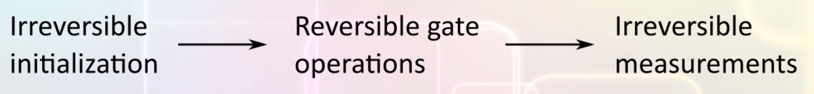

# Multi-qubit system

## Analyzing multi-qubit system
If we have two qubits, we just write down all the possible combinations: 
```
0 0 --> 1 --> |00>
0 1 --> 0 --> |01>
1 0 --> 0 --> |10>
1 1 --> 0 --> |11>
```
The state vector will have four elements, one for each combination.  
We can perform measurements and reversible transformations on multi-qubit states exactly like single qubits states.

## Superposition of 2-qubits state
The state can be in superposition:  
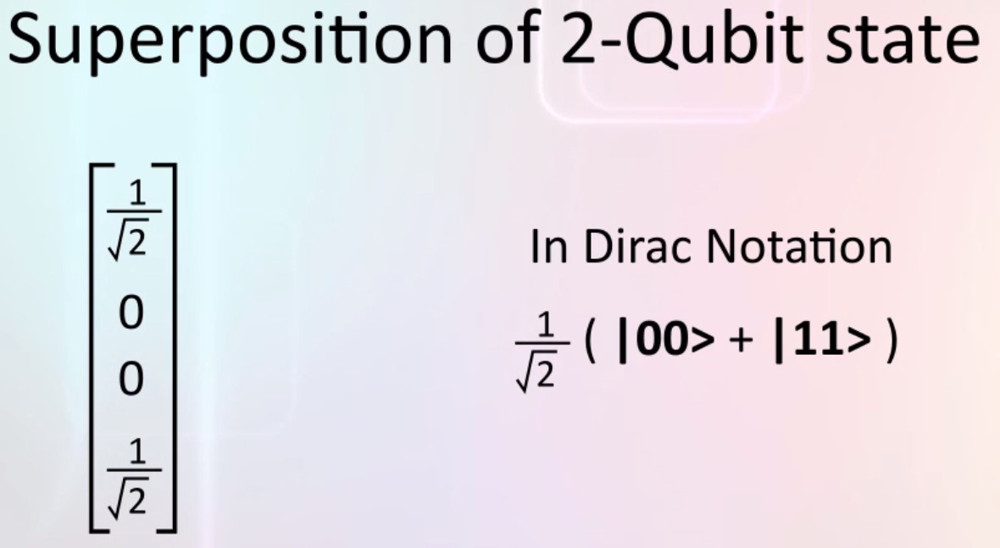  
What do the numbers in this state vector mean?  
If we set up an apparatus to measure if the two qubits are both 0, then the probability of the measuremennt apparatus producing result of YES is the square magnitude of the first number. ```P(00) = 0.5```  
Similarly if we measure if the first qubit is 0 and the second qubit is simultaneously 1 the probability of that is the second number, same for the P(10) with the third number. ```P(01) = 0``` and ```P(10) = 0```  
Finally the probability of both qubits being 1 is the square magnitude of 1 by root 2 which is 0.5. ```P(11) = 0.5```  

# Entanglement

## Entanglement
Consider this state vector for a two qubit system:  
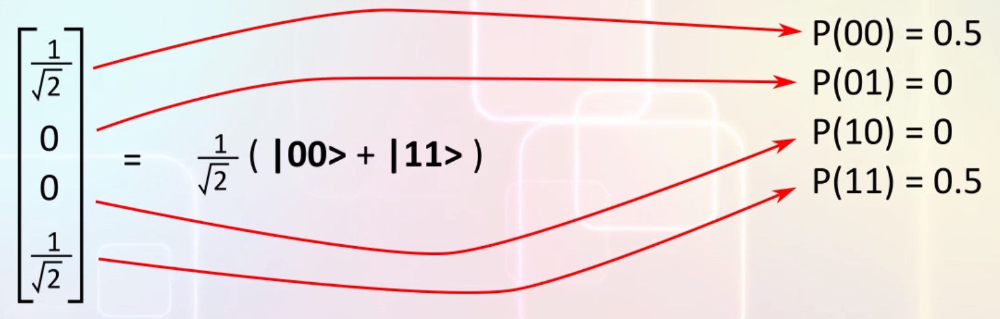  
The probability that first qubit has the same value as second qubit = 1.0, whatever measurement we make on a system in this state, the two qubits will be equal.  
The value of one qubit is connected to the value of the other qubit.  
In this case we say that the two qubits are **ENTANGLED**.  
Mathematically, it is possible to test if a multi-qubit state is entangled or not.  